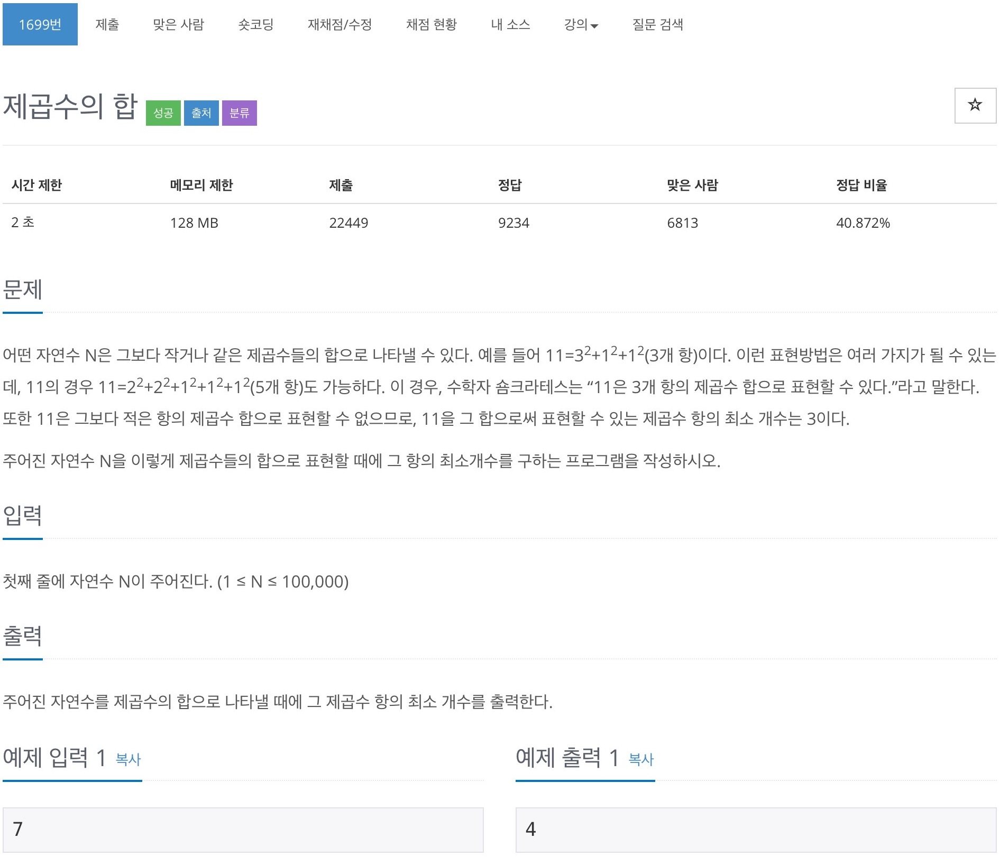

# 백준 1699 - 제곱수의 합



## 전체 소스 코드
```cpp
#include <iostream>
using namespace std;

int n;
int dp[100010];

int main(void) {
    cin >> n;

    for (int i = 1; i <= n; i++) {
        dp[i] = i;
    }

    dp[0] = 1;
    int i = 2;
    while (i * i <= n && i * i <= 100000) {
        int cnt = i * i;

        dp[cnt] = 1;
        for (int j = cnt + 1; j <= 100000; j++) {
            dp[j] = min(dp[j], dp[cnt] + dp[j - cnt]);

            if (j >= n) {
                break;
            }
        }
        i++;
    }

    cout << dp[n] << endl;
    return 0;
}
```