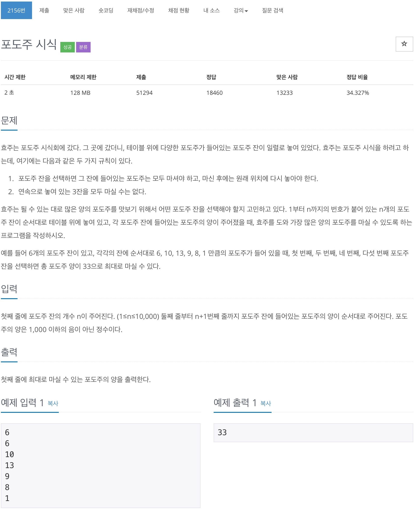

# 백준 2156 - 포도주 시식



## 전체 소스 코드
```cpp
#include <iostream>
using namespace std;

int n;
int graph[10001];
int dp[10001][3];

int main(void) {
    cin >> n;

    for (int i = 0; i < n; i++) {
        cin >> graph[i];
    }

    dp[0][0] = 0;
    dp[0][1] = graph[0];

    for (int i = 1; i < n; i++) {
        dp[i][0] = max(dp[i - 1][0], max(dp[i - 1][1], dp[i - 1][2]));
        dp[i][1] = dp[i - 1][0] + graph[i];
        dp[i][2] = dp[i - 1][1] + graph[i];
    }

    cout << max(dp[n - 1][0], max(dp[n - 1][1], dp[n - 1][2])) << '\n';
    return 0;
}
```