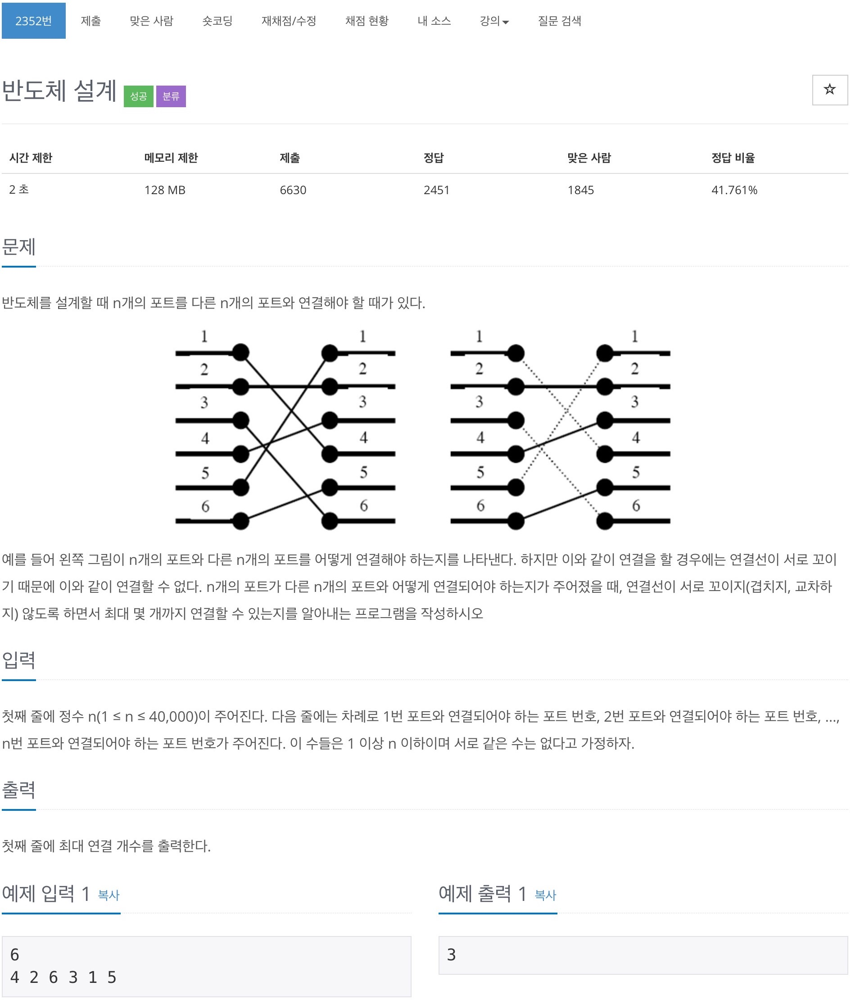

# 백준 2352 - 반도체 설계



## 전체 소스 코드
```cpp
#include <algorithm>
#include <iostream>
#include <vector>
using namespace std;

#define MAX 40004

int n;

int main(void) {
    cin >> n;

    vector<int> arr(MAX);
    vector<int> cache;

    for (int i = 0; i < n; i++) {
        cin >> arr[i];
    }

    cache.push_back(arr[0]);
    for (int i = 1; i <= n; i++) {
        if (cache.back() < arr[i]) {
            cache.push_back(arr[i]);
        } else {
            int index = lower_bound(cache.begin(), cache.end(), arr[i]) - cache.begin();
            cache[index] = arr[i];
        }
    }

    cout << cache.size() << '\n';
    return 0;
}
```