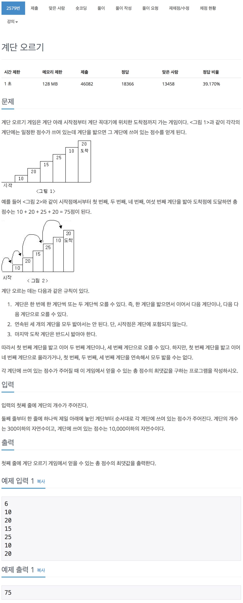

# 백준 2579 - 계단 오르기

[2579 - 계단오르기](https://www.acmicpc.net/problem/2579)



```cpp
#include <iostream>
#include <vector>
using namespace std;

int n;
// 1. 점수, 2. 합계
int stair[10001];
int max_score;

void move(pair<int, int> p, int score)
{
    int cnt = p.first;
    int st = p.second;

    if (st == 2)
    {
        int pre_score, cnt_score;
        pre_score = score;
        cnt += 2;
        st = 1;
        // 현재 계단 점수 + 이전까지의 계단 점수
        cnt_score = stair[cnt] + pre_score;

        // 계단을 넘어 섰을 때
        if (cnt > n)
        {
            return;
        }
        if (cnt == n)
        {
            if (max_score < cnt_score)
                max_score = cnt_score;
            return;
        }
        move(make_pair(cnt, st), cnt_score);
    }

    else
    {
        // +1 만큼 움직일 때
        int pre_score, cnt_score;
        pre_score = score;
        cnt = p.first + 1;
        st++;
        // 현재 계단 점수 + 이전까지의 계단 점수
        cnt_score = stair[cnt] + pre_score;

        if (cnt > n)
        {
            return;
        }
        if (cnt == n)
        {
            if (max_score < cnt_score)
                max_score = cnt_score;
            return;
        }
        move(make_pair(cnt, st), cnt_score);

        // +2만큼 움직일 때
        pre_score = score;
        cnt = p.first + 2;
        st = 1;
        // 현재 계단 점수 + 이전까지의 계단 점수
        cnt_score = stair[cnt] + pre_score;

        if (cnt > n)
        {
            return;
        }
        if (cnt == n)
        {
            if (max_score < cnt_score)
                max_score = cnt_score;
            return;
        }
        move(make_pair(cnt, st), cnt_score);
    }
}

int main(void)
{
    scanf("%d", &n);
    vector<int> arr(n);

    for (int i = 1; i <= n; i++)
    {
        int temp;
        scanf("%d", &temp);
        stair[i] = temp;
    }
    // 1. 현재 위치, 2. stack
    pair<int, int> ob = make_pair(0, 0);
    move(ob, 0);

    for (int i = 0; i <= n; i++)
    {
        cout << stair[i] << endl;
    }

    printf("%d", max_score);
}
```
