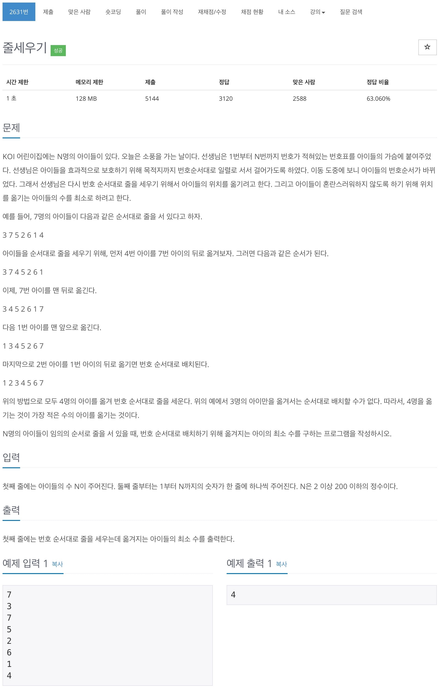

# 백준 2631 - 줄세우기



## 체점 현황


## 문제풀이

가장 긴 증가하는 부분수열의 개념을 이용한 문제이다. 중요한건 이전에 풀었던 방식이 생각이 안난다는거.... 무튼, 주어진 수열에서 가장 긴 증가하는 부분수열을 구해준 뒤 `N`에서 그 값을 빼주면 원하는 답이 나온다.

## 전체 소스 코드

```cpp
#include <bits/stdc++.h>
using namespace std;

vector<int> v;

int main(void) {
    int n;
    cin >> n;
    v = vector<int>(n + 1);
    vector<int> dp(n + 1);

    v[0] = 1;
    for (int i = 1; i <= n; i++) {
        cin >> v[i];
    }

    for (int i = 0; i <= n; i++) {
        int cntValue = v[i];

        for (int j = i + 1; j <= n; j++) {
            if (v[j] >= cntValue) {
                if (dp[j] < dp[i] + 1) {
                    dp[j] = dp[i] + 1;
                }
            }
        }
    }

    int maxValue = *max_element(dp.begin() + 1, dp.end() + 1);
    cout << n - maxValue << '\n';
    return 0;
}
```
