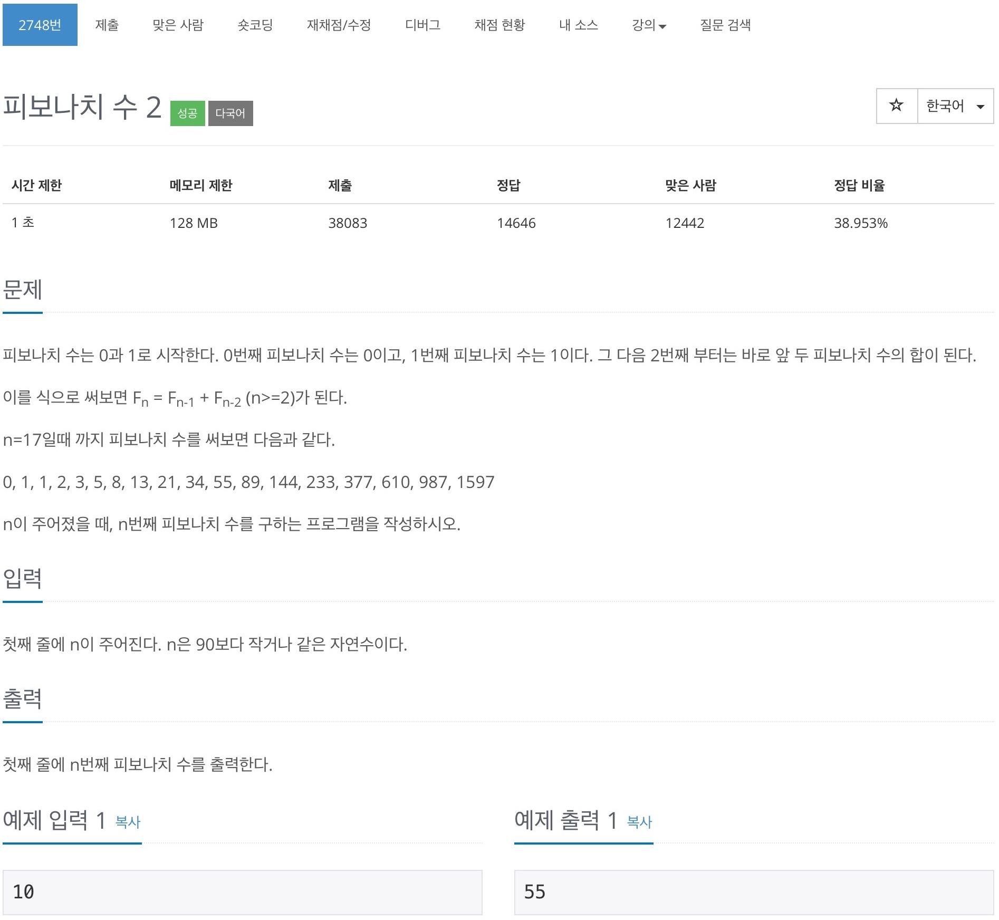

# 백준 2748 - 피보나치 2

https://www.acmicpc.net/problem/2748



## 전체 소스 코드
```cpp
#include <iostream>
#include <vector>
using namespace std;

vector<long long> v;
int n;

int main(void) {
    cin >> n;
    v.push_back(0);
    v.push_back(1);

    if (n == 0) {
        cout << 0 << '\n';
        return 0;
    } else if (n == 1) {
        cout << 1 << '\n';
        return 0;
    }

    int i = 0;
    while (i < n) {
        v.push_back(v[i] + v[i + 1]);
        i++;
    }
    cout << v[n] << '\n';
    return 0;
}
```
