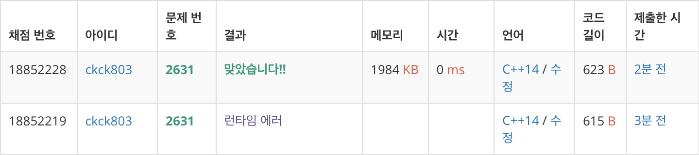

# 다이나믹 프로그래밍

| 문제            | 이름                        | 링크                                  | 정리여부 | 비고 |
| --------------- | --------------------------- | ------------------------------------- | -------- | ---- |
| [1003](1003/)   | 피보나치 함수               | https://www.acmicpc.net/problem/1003  |          |      |
| [1010](1010/)   | 다리놓기                    | https://www.acmicpc.net/problem/1010  |          |      |
| [1149](1149/)   | RGB거리                     | https://www.acmicpc.net/problem/1149  |          |      |
| [1699](1699/)   | 제곱수의 합                 | https://www.acmicpc.net/problem/1699  |          |      |
| [1912](1912/)   | 연속합                      | https://www.acmicpc.net/problem/1003  |          |      |
| [1932](1932/)   | 정수 삼각형                 | https://www.acmicpc.net/problem/1932  |          |      |
| [2156](2156/)   | 포도주 시식                 | https://www.acmicpc.net/problem/2156  |          |      |
| [2163](2163/)   | 초콜릿 자르기               | https://www.acmicpc.net/problem/2163  |          |      |
| [2167](2167/)   | 2차원 배열의 합             | https://www.acmicpc.net/problem/2167  |          |      |
| [2193](2193/)   | 이친수                      | https://www.acmicpc.net/problem/2193  |          |      |
| [2293](2293/)   | 동전 1                      | https://www.acmicpc.net/problem/2293  |          |      |
| [2294](2294/)   | 동전 2                      | https://www.acmicpc.net/problem/1003  |          |      |
| [2352](2352/)   | 반도체 설계                 | https://www.acmicpc.net/problem/2352  |          |      |
| [2579](2579/)   | 계단 오르기                 | https://www.acmicpc.net/problem/2579  |          |      |
| [2631](2631/)   | 줄 세우기                   | https://www.acmicpc.net/problem/2631  |          |      |
| [2748](2748/)   | 피보나치 수2                | https://www.acmicpc.net/problem/2748  |          |      |
| [9095](9095/)   | 1,2,3 더하기                | https://www.acmicpc.net/problem/9095  |          |      |
| [9461](9461/)   | 파도반 수열                 | https://www.acmicpc.net/problem/9461  |          |      |
| [9465](9465/)   | 스티커                      | https://www.acmicpc.net/problem/9465  |          |      |
| [10844](10844/) | 쉬운 계단 수                | https://www.acmicpc.net/problem/10844 |          |      |
| [11048](11048/) | 이동하기                    | https://www.acmicpc.net/problem/11048 |          |      |
| [11051](11051/) | 이항 계수                   | https://www.acmicpc.net/problem/11051 |          |      |
| [11052](11052/) | 카드 구매하기               | https://www.acmicpc.net/problem/11052 |          |      |
| [11053](11053/) | 가장 긴 증가하는 부분 수열  | https://www.acmicpc.net/problem/11053 |          |      |
| [11054](11054/) | 가장 긴 바이토닉 부분 수열  | https://www.acmicpc.net/problem/11054 |          |      |
| [11055](11055/) | 가장 긴 증가 부분 수열      | https://www.acmicpc.net/problem/11055 |          |      |
| [11057](11057/) | 오르막 수                   | https://www.acmicpc.net/problem/11057 |          |      |
| [11722](11722/) | 가장 긴 감소하는 부분 수열  | https://www.acmicpc.net/problem/11722 |          |      |
| [11726](11726/) | 2 x N 타일링                | https://www.acmicpc.net/problem/11726 |          |      |
| [12015](12015/) | 가장 긴 증가하는 부분 수열2 | https://www.acmicpc.net/problem/12015 |          |      |
| [14002](14002/) | 가장 긴 증가하는 부분 수열4 | https://www.acmicpc.net/problem/14002 |          |      |
| [14003](14003/) | 가장 긴 증가하는 부분 수열5 | https://www.acmicpc.net/problem/14003 |          |      |
| [14500](14500/) | 테크로미노                  | https://www.acmicpc.net/problem/14500 |          |      |
| [14501](14501/) | 퇴사                        | https://www.acmicpc.net/problem/14501 |          |      |

## 체점 현황

## [2631](2631/) - 줄세우기

