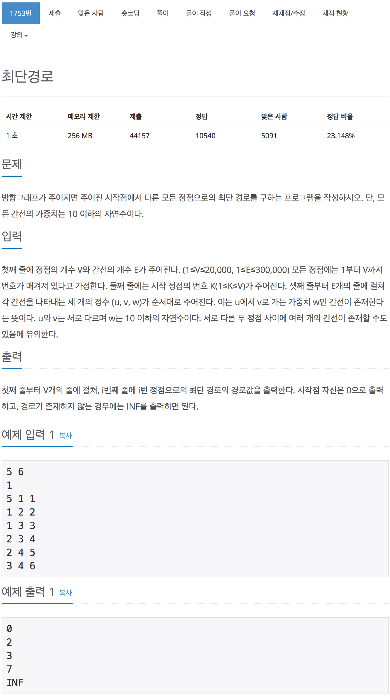

# 백준 1753 - 최단경로

[1753 - 최단경로](https://www.acmicpc.net/problem/1753)



#### 우선순위 큐

```cpp
priority_queue<pair<int, int>, vector<pair<int, int>>, greater<pair<int, int>>> pq;
```
저장한 값 중에서 작은 값부터 나올 수 있도록 `우선순위 큐`를 사용해서 문제를 풀 것이다.
`pair<int, int>` : 원소의 자료 형
`vector<pair<int,int>>` : 컨테이너의 자료형
`greater<pair<int,int>>` : 비교 함수 

<br>

```cpp
for (int i = 1; i <= v; i++)
    dist[i] = INF;
dist[start_node] = 0;
priority_queue<pair<int, int>, vector<pair<int, int>>, greater<pair<int, int>>> pq;
pq.push({0, start_node});
```

<br>

```cpp
int weight = pq.top().first;
int cnt_node = pq.top().second;
pq.pop();

// 같은 node일때 더 작은 weight값을 갖는게 먼저 선택이 된다.
// 나중에 나오는 것은 weight값이 더 큰게 나오게 되므로 거른다.
if (dist[cnt_node] < weight)
    continue;

// check를 사용하고 싶은 경우에는 밑에 코드를 사용해도 의미적으로 틀리지는 않는다.
// if (check[cnt_node] == true)
//     continue;
// check[cnt_node] = true;
```

<br>

```cpp
// 점 cnt_node에 연결된 간선의 개수
int edge_num = graph[cnt_node].size();
for (int j = 0; j < edge_num; j++)
{
    // from : 현재 위치, to : 다음 위치, from_to_weight : 현재위치에서 다음위치 까지의 가중치
    int from = cnt_node,
        to = graph[cnt_node][j].first,
        from_to_weight = graph[cnt_node][j].second;

    if (dist[to] > dist[from] + from_to_weight)
    {
        dist[to] = dist[from] + from_to_weight;
        pq.push({dist[to], to});
    }
}
```

<br>

```cpp
void dijkstra()
{
    for (int i = 1; i <= v; i++)
        dist[i] = INF;
    dist[start_node] = 0;
    priority_queue<pair<int, int>, vector<pair<int, int>>, greater<pair<int, int>>> pq;
    pq.push({0, start_node});

    while (!pq.empty())
    {
        int weight = pq.top().first;
        int cnt_node = pq.top().second;
        pq.pop();

        // check를 사용하고 싶은 경우에는 밑에 코드를 사용해도 의미적으로 틀리지는 않는다.
        // if (check[cnt_node] == true)
        //     continue;
        // check[cnt_node] = true;


        // 같은 node일때 더 작은 weight값을 갖는게 먼저 선택이 된다.
        // 나중에 나오는 것은 weight값이 더 큰게 나오게 되므로 거른다.
        if (dist[cnt_node] < weight)
            continue;

        // 점 cnt_node에 연결된 간선의 개수
        int edge_num = graph[cnt_node].size();
        for (int j = 0; j < edge_num; j++)
        {
            // from : 현재 위치, to : 다음 위치, from_to_weight : 현재위치에서 다음위치 까지의 가중치
            int from = cnt_node,
                to = graph[cnt_node][j].first,
                from_to_weight = graph[cnt_node][j].second;

            if (dist[to] > dist[from] + from_to_weight)
            {
                dist[to] = dist[from] + from_to_weight;
                pq.push({dist[to], to});
            }
        }
    }
}
```

<br>

```cpp
#include <iostream>
#include <vector>
#include <queue>
using namespace std;

#define INF 2000000000

// 정점의 개수 : v, 간선의 개수 : e
int v, e;
vector<vector<pair<int, int>>> graph;
vector<int> dist;
vector<bool> check;
int start_node;

void dijkstra()
{
    for (int i = 1; i <= v; i++)
        dist[i] = INF;
    dist[start_node] = 0;
    priority_queue<pair<int, int>, vector<pair<int, int>>, greater<pair<int, int>>> pq;
    pq.push({0, start_node});

    while (!pq.empty())
    {
        int weight = pq.top().first;
        int cnt_node = pq.top().second;
        pq.pop();

        // if (check[cnt_node] == true)
        //     continue;
        // check[cnt_node] = true;

        // 같은 node일때 더 작은 weight값을 갖는게 먼저 선택이 된다.
        // 나중에 나오는 것은 weight값이 더 큰게 나오게 되므로 거른다.
        if (dist[cnt_node] < weight)
            continue;

        // 점 cnt_node에 연결된 간선의 개수
        int edge_num = graph[cnt_node].size();
        for (int j = 0; j < edge_num; j++)
        {
            // from : 현재 위치, to : 다음 위치, from_to_weight : 현재위치에서 다음위치 까지의 가중치
            int from = cnt_node,
                to = graph[cnt_node][j].first,
                from_to_weight = graph[cnt_node][j].second;

            if (dist[to] > dist[from] + from_to_weight)
            {
                dist[to] = dist[from] + from_to_weight;
                pq.push({dist[to], to});
            }
        }
    }
}

int main(void)
{
    scanf("%d %d %d", &v, &e, &start_node);
    dist = vector<int>(v + 1, INF);
    check = vector<bool>(v + 1, false);
    graph = vector<vector<pair<int, int>>>(v + 1);

    for (int i = 0; i < e; i++)
    {
        int from, to, weight;
        scanf("%d %d %d", &from, &to, &weight);
        graph[from].push_back({to, weight});
    }
    dijkstra();

    for (int i = 1; i <= v; i++)
    {
        if (dist[i] == INF)
            printf("INF\n");
        else
        {
            printf("%d\n", dist[i]);
        }
    }

    return 0;
}
```
