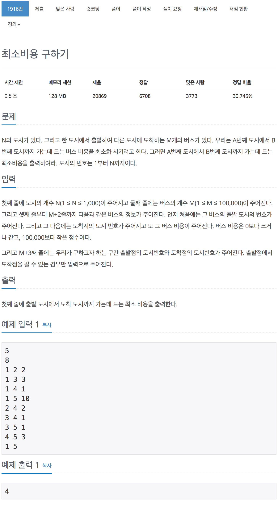

# 백준 1916 - 최소비용 구하기

[1916 - 최소비용 구하기](https://www.acmicpc.net/problem/1916)



#### 다익스트라 알고리즘
최단거리를 구하는 문제에서 사용하는 대표적인 알고리즘  
시작점이 주어져 있고 그 시작점에서 다른 점들로 가는 최단거리를 구하는 문제에서 사용한다.
`간선의 weight값이 음이 아닌 정수` 일때만 사용할 수 있다. 만약 음수의 값을 갖게 된다면 거리를 갱신하는 도중에 `값이 커지는 방향이 아닌 더 작게 변하는 방향으로 갱신` 되므로 다익스트라 알고리즘을 사용할 수 없게 된다.

1. 시작점으로부터 갈 수 있는 각 정점을 확인한다.(`dist[start] = 0`).
2. 이전 값과 비교해서 더 작은 값으로 갱신한다.
3. 각 정점까지의 거리`dist[i]` 중 가장 최소 값를 갖는 정점을 고른다.
4. 값이 선택된 적이 있는 정점인지 확인해 본다.
   - 4.1 만약 선택된 점이 있다고 하면 그 다음 최소 값을 고른다음에 3으로 돌아간다.
   - 4.2 만약 선택된 적이 없다고 하면 다음으로 넘어간다.
5. 해당 정점에서부터 갈 수 있는 갈 수 있는 각 정점의 거리를 구한뒤 2로 넘어가서 반복한다.

<br>

초기 설정
---------

#### 초기값
```cpp 
// 초기값 1억
int initial_value = 100000000;
```

#### 각 정점의 최단거리 초기화
```cpp
for (int i = 1; i <= n; i++)
{
    dis[i] = initial_value;
}
```
다익스트라는 최단거리를 구하는 알고리즘이므로 초기 값을 `max`값으로 두고 시작


#### 그래프 초기화 

```cpp
for (int i = 1; i <= n; i++)
    for (int j = 1; j <= n; j++)
        arr[i][j] = initial_value;
```
배열을 사용할 경우 아직 그래프의 간선들이 연결 되어 있지 않는 상태일 때는 원소들이 `최대값`을 갖게 한다.  

초기 값들을 0으로 놓고 시작하지 않는 이유는 `다익스트라는 weight값이 0이상 곳에서 사용하는 알고리즘이고`, 우리는 최소값을 찾는게 목표이므로 최대한 높은 값부터 시작해 내려가는 방식으로 값을 찾는다. 즉, 초기 값이 0이면 모두 초기값으로 최소값을 갖고 있다는 의미가 된다.


입력
-----

#### 각 간선과 weight값 입력
```cpp
for (int i = 1; i <= m; i++)
{
    int v1, v2, weight;
    scanf("%d %d %d", &v1, &v2, &weight);
    //들어온 간선들 중에서 가장 최소값을 갖게 한다.
    if (arr[v1][v2] > weight)
        arr[v1][v2] = weight;
}
```

#### 중요!

```cpp
if (arr[v1][v2] > weight)
        arr[v1][v2] = weight;
```

해당 조건문이 없으면 제일 마지막으로 들어온 간선의 값으로 그래프가 설정된다.
두 정점간의 간선이 1개라는 말이 없으므로 들어온 여러가지 간선들 중에서 최단거리에 필요한 가장 작은 값을 갖는 간선만 선택한다.


다익스트라 알고리즘 코드
------------------

#### 탐색을 시작할 노드를 찾기

```cpp
int cnt;
int min = initial_value;
for (int i = 1; i <= n; i++)
{
    if (min > dis[i] && check[i] == false)
    {
        min = dis[i];
        cnt = i;
    }
}
check[cnt] = true;
```

모든 정점을 순회하면서 가장 작은 거리를 갖는 정점을 찾는다.
정점을 찾은 경우에는 이전에 들렸던 값인지 유효성 검사를 해본다. 만약 들리지 않은 점일 경우 선택해주고, 들린적이 있을 경우 선택하지 않는다.

#### 경로 갱신

```cpp
for (int i = 1; i <= n; i++)
{
    if (dis[i] > dis[cnt] + arr[cnt][i])
        dis[i] = dis[cnt] + arr[cnt][i];
}
```

- `dis[i]` : 이전에 등록된 시작점에서 i까지의 최단 비용
- `dis[cnt]` : 시작점에서 cnt까지의 최단비용
- `arr[cnt][i]` : cnt에서 시작해서 i까지의 비용

즉, `dis[i] > dis[cnt] + arr[cnt][i]`는 이전에 등록된 시작점에서 i까지의 최단 비용이
시작점에서 `cnt`를 거친후 `i`까지 도달하는 비용보다 크다면 갱신시켜라! 이런 의미인 것이다.

<br><br>

## 전체 소스 코드

```cpp
#include <iostream>
#include <vector>
using namespace std;

int n, m, s, e;
int arr[1001][1001];
int dis[1001];
int initial_value = 100000000;
bool check[1001];

int main(void)
{
    scanf("%d %d", &n, &m);
    for (int i = 1; i <= n; i++)
    {
        dis[i] = initial_value;
    }

    for (int i = 1; i <= n; i++)
        for (int j = 1; j <= n; j++)
            arr[i][j] = initial_value;

    for (int i = 1; i <= m; i++)
    {
        int v1, v2, weight;
        scanf("%d %d %d", &v1, &v2, &weight);
        if (arr[v1][v2] > weight)
            arr[v1][v2] = weight;
    }

    scanf("%d %d", &s, &e);
    dis[s] = 0;
    int num = n;

    while (num--)
    {
        int cnt;
        int min = initial_value;
        for (int i = 1; i <= n; i++)
        {
            if (min > dis[i] && check[i] == false)
            {
                min = dis[i];
                cnt = i;
            }
        }
        check[cnt] = true;

        for (int i = 1; i <= n; i++)
        {
            if (dis[i] > dis[cnt] + arr[cnt][i])
                dis[i] = dis[cnt] + arr[cnt][i];
        }
    }

    printf("%d\n", dis[e]);
    return 0;
}
```
