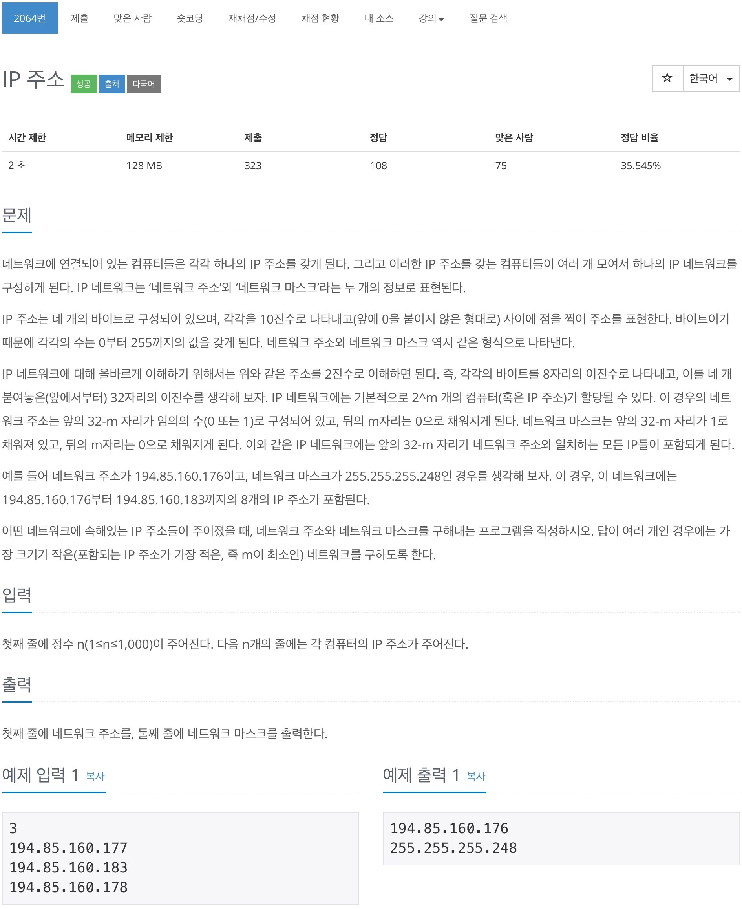

# 백준 2064 - IP 주소



## 전체 소스 코드
```cpp
#include <bits/stdc++.h>
using namespace std;

int n;
int net_addr[1001];

string makeAddr(int addr) {
    int filter = (1 << 8) - 1;

    int firstValue = (addr >> 24) & filter;
    int secondValue = (addr >> 16) & filter;
    int thirdValue = (addr >> 8) & filter;
    int forthValue = (addr)&filter;

    return to_string(firstValue) + '.' + to_string(secondValue) + '.' + to_string(thirdValue) + '.' + to_string(forthValue);
}

int main(void) {
    cin >> n;
    for (int i = 0; i < n; i++) {
        string addr;
        cin >> addr;

        stringstream sst(addr);
        string num;

        // stringstream을 이용한 토크나이징 사용하기
        while (getline(sst, num, '.')) {
            net_addr[i] <<= 8;
            net_addr[i] |= stoi(num);
        }
    }

    int subnetMask = 0;

    for (int i = 31; i >= 0; i--) {
        int bit = 1 << i;

        bool allHave = true;
        for (int i = 0; i < n; i++) {
            if ((net_addr[i] & bit) != (net_addr[0] & bit))
                allHave = false;
        }

        if (!allHave)
            break;
        else
            subnetMask |= bit;
    }

    cout << makeAddr(net_addr[0] & subnetMask) << '\n';
    cout << makeAddr(subnetMask) << '\n';
    return 0;
}
```