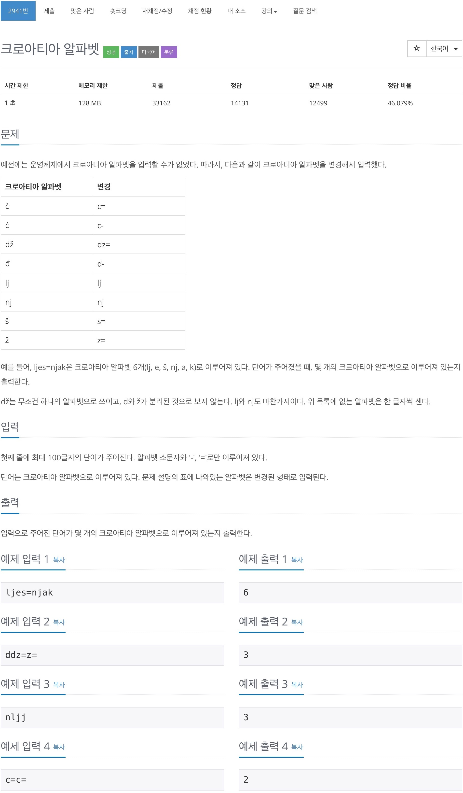

# 백준 2941 - 크로아티아 알파벳



## cpp 코드
```cpp
#include <bits/stdc++.h>
using namespace std;

string word;
vector<string> croatia_word = {"c=", "c-", "dz=", "d-", "lj", "nj", "s=", "z="};

int main(void) {
    cin >> word;

    for (int i = 0; i < croatia_word.size(); i++) {
        while (word.find(croatia_word[i]) != string::npos) {
            int start = word.find(croatia_word[i]);
            word.replace(start, croatia_word[i].length(), "*");
        }
    }

    cout << word.length() << '\n';
    return 0;
}
```

## python 코드

```python
a = ['c=', 'c-', 'dz=', 'd-', 'lj', 'nj', 's=', 'z=']
s = input()
for t in a:
    s = s.replace(t, "*")

print(len(s))
```

## java 코드

```java
public class Main {
    public static void main(String[] args) throws IOException {
        BufferedReader br = new BufferedReader(new InputStreamReader(System.in));
        String word = br.readLine().trim();
        String croatia_word[] = { "c=", "c-", "dz=", "d-", "lj", "nj", "s=", "z=" };

        for (int i = 0; i < croatia_word.length; i++) {
            word = word.replace(croatia_word[i], "*");
        }

        System.out.println(word.length());

        br.close();
    }
}
```