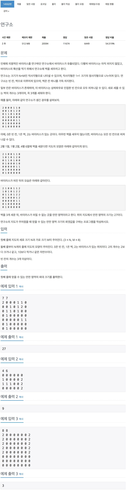

# 백준 14502 - 연구소

[14502 - 연구소](https://www.acmicpc.net/problem/14502)



```cpp
#include <iostream>
#include <queue>
#include <algorithm>
using namespace std;

#define MAX 9

int n, m;
int lab[MAX][MAX];
int temp_lab[MAX][MAX];
int result;
int dx[4] = {1, -1, 0, 0};
int dy[4] = {0, 0, 1, -1};

void bfs()
{
    int afterSpread[MAX][MAX];

    for (int i = 0; i < n; i++)
        for (int j = 0; j < m; j++)
            afterSpread[i][j] = temp_lab[i][j];

    queue<pair<int, int>> q;

    for (int i = 0; i < n; i++)
        for (int j = 0; j < m; j++)
            if (afterSpread[i][j] == 2)
                q.push({i, j});

    while (!q.empty())
    {
        int y = q.front().first;
        int x = q.front().second;
        q.pop();

        for (int i = 0; i < 4; i++)
        {
            int ny = y + dy[i];
            int nx = x + dx[i];

            if (0 <= ny && ny < n && 0 <= nx && nx < m)
                if (afterSpread[ny][nx] == 0)
                {
                    afterSpread[ny][nx] = 2;
                    q.push({ny, nx});
                }
        }
    }

    int empty = 0;
    for (int i = 0; i < n; i++)
        for (int j = 0; j < m; j++)
            if (afterSpread[i][j] == 0)
                empty++;

    result = max(result, empty);
}

void makeWall(int cnt)
{
    if (cnt == 3)
    {
        bfs();
        return;
    }

    for (int i = 0; i < n; i++)
        for (int j = 0; j < m; j++)
            if (temp_lab[i][j] == 0)
            {
                temp_lab[i][j] = 1;
                makeWall(cnt + 1);
                temp_lab[i][j] = 0;
            }
}

int main(void)
{
    cin >> n >> m;
    for (int i = 0; i < n; i++)
        for (int j = 0; j < m; j++)
            cin >> lab[i][j];

    for (int i = 0; i < n; i++)
        for (int j = 0; j < m; j++)
            if (lab[i][j] == 0)
            {
                for (int k = 0; k < n; k++)
                    for (int l = 0; l < m; l++)
                        temp_lab[k][l] = lab[k][l];

                temp_lab[i][j] = 1;
                makeWall(1);
                temp_lab[i][j] = 0;
            }

    cout << result << '\n';
    return 0;
}
```
