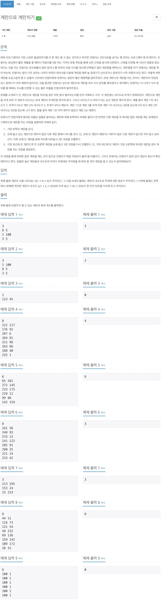

# 백준 16987 - 계란으로 계란치기



## 전체 소스 코드
```cpp
#include <bits/stdc++.h>
using namespace std;

int N;
int maxNum;
pair<int, int> egg[9];

bool isAllBroken(int index) {
    for (int i = 0; i < N; i++) {
        if (i == index) {
            continue;
        }
        if (egg[i].first > 0) {
            return false;
        }
    }

    return true;
}

void breakEgg(int index) {
    if (index == N) {
        int num = 0;
        for (int i = 0; i < N; i++) {
            if (egg[i].first <= 0) {
                num++;
            }
        }
        maxNum = max(maxNum, num);

        return;
    }

    if (egg[index].first <= 0 || isAllBroken(index)) {
        breakEgg(index + 1);
        return;
    }

    for (int i = 0; i < N; i++) {
        if (i == index) {
            continue;
        }

        if (egg[i].first > 0) {
            egg[i].first -= egg[index].second;
            egg[index].first -= egg[i].second;
            breakEgg(index + 1);
            egg[index].first += egg[i].second;
            egg[i].first += egg[index].second;
        }
    }
}

int main(void) {
    cin >> N;
    for (int i = 0; i < N; i++) {
        cin >> egg[i].first >> egg[i].second;
    }

    breakEgg(0);
    cout << maxNum << '\n';
    return 0;
}
```