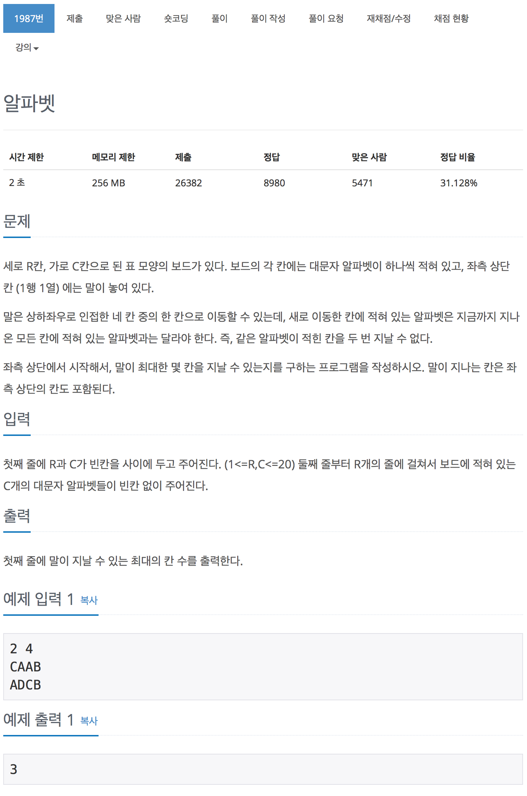

# 백준 1987 - 알파벳

[1987 - 알파벳](https://www.acmicpc.net/problem/1987)



<br>

```cpp
void dfs(int y, int x, int cnt)
{
    ans = max(ans, cnt);

    for (int i = 0; i < 4; i++)
    {
        int ny = y + dy[i];
        int nx = x + dx[i];

        // 범위내에 있는지 확인
        if (ny < 0 || ny >= r || nx < 0 || nx >= c)
            continue;

        int k = (int)board[ny][nx] - 'A';
        // 한번 선택한 적이 있는지 확인
        if (alphabet[k])
            continue;

        // 선택한다.
        alphabet[k]++;
        // 다음으로 넘어간다.
        dfs(ny, nx, cnt + 1);
        // 선택한 것을 해지한다.
        alphabet[k]--;
    }
}
```

`DFS`를 이용하여 문제를 해결 하였다. 하나 하나씩 check하면서 문제를 풀어나가야 하기 때문에 한 번에 여러 사항을 고려 하는 `BFS`와는 맞지 않은 문제이다.
`alphabet[i]`은 해당 알파벳이 선택됭적이 있는지 확인하기 위한 배열로 사용된다.

<br>

## 전체 소스 코드

```cpp
#include <iostream>
using namespace std;

int R, C;
char map[22][22];
bool check[26];
int dx[4] = {1, 0, -1, 0};
int dy[4] = {0, 1, 0, -1};
int maxNum;

void dfs(int y, int x, int num) {
    if (maxNum < num) {
        maxNum = num;
    }

    for (int i = 0; i < 4; i++) {
        int ny = y + dy[i];
        int nx = x + dx[i];

        if (0 <= ny && ny < R && 0 <= nx && nx < C) {
            char nextColor = map[ny][nx];

            if (check[nextColor - 'A'] == false) {
                check[nextColor - 'A'] = true;
                dfs(ny, nx, num + 1);
                check[nextColor - 'A'] = false;
            }
        }
    }
}

int main(void) {
    cin >> R >> C;

    for (int i = 0; i < R; i++) {
        for (int j = 0; j < C; j++) {
            cin >> map[i][j];
        }
    }

    check[map[0][0] - 'A'] = true;
    dfs(0, 0, 1);

    cout << maxNum << endl;
    return 0;
}
```
