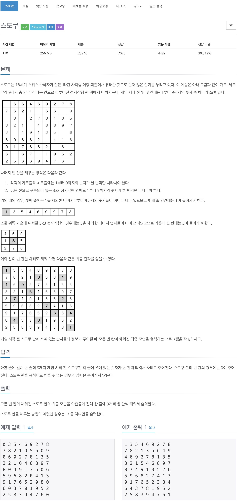

# 스도쿠



## 전체 소스 코드
```cpp
#include <iostream>
#include <queue>
#include <vector>
using namespace std;

int sudoku[9][9];
vector<pair<int, int>> point;
bool isFinish = false;

void makeSudoku(int index) {
    if (isFinish) {
        return;
    }

    if (index == point.size()) {
        for (int i = 0; i < 9; i++) {
            for (int j = 0; j < 9; j++) {
                cout << sudoku[i][j] << " ";
            }
            cout << endl;
        }

        isFinish = true;
        return;
    }

    int y = point[index].first;
    int x = point[index].second;

    vector<int> check(10, false);

    for (int i = 0; i < 9; i++) {
        check[sudoku[y][i]] = true;
    }

    for (int i = 0; i < 9; i++) {
        check[sudoku[i][x]] = true;
    }

    if (y < 3 && x < 3) {
        for (int i = 0; i < 3; i++) {
            for (int j = 0; j < 3; j++) {
                check[sudoku[i][j]] = true;
            }
        }
    } else if (y < 3 && x < 6) {
        for (int i = 0; i < 3; i++) {
            for (int j = 3; j < 6; j++) {
                check[sudoku[i][j]] = true;
            }
        }
    } else if (y < 3 && x < 9) {
        for (int i = 0; i < 3; i++) {
            for (int j = 6; j < 9; j++) {
                check[sudoku[i][j]] = true;
            }
        }
    } else if (y < 6 && x < 3) {
        for (int i = 3; i < 6; i++) {
            for (int j = 0; j < 3; j++) {
                check[sudoku[i][j]] = true;
            }
        }
    } else if (y < 6 && x < 6) {
        for (int i = 3; i < 6; i++) {
            for (int j = 3; j < 6; j++) {
                check[sudoku[i][j]] = true;
            }
        }
    } else if (y < 6 && x < 9) {
        for (int i = 3; i < 6; i++) {
            for (int j = 6; j < 9; j++) {
                check[sudoku[i][j]] = true;
            }
        }
    } else if (y < 9 && x < 3) {
        for (int i = 6; i < 9; i++) {
            for (int j = 0; j < 3; j++) {
                check[sudoku[i][j]] = true;
            }
        }
    } else if (y < 9 && x < 6) {
        for (int i = 6; i < 9; i++) {
            for (int j = 3; j < 6; j++) {
                check[sudoku[i][j]] = true;
            }
        }
    } else {
        for (int i = 6; i < 9; i++) {
            for (int j = 6; j < 9; j++) {
                check[sudoku[i][j]] = true;
            }
        }
    }

    for (int i = 1; i < 10; i++) {
        if (check[i] == false) {
            sudoku[y][x] = i;
            makeSudoku(index + 1);
            sudoku[y][x] = 0;
        }
    }
}

int main(void) {
    for (int i = 0; i < 9; i++) {
        for (int j = 0; j < 9; j++) {
            cin >> sudoku[i][j];

            if (sudoku[i][j] == 0) {
                point.push_back({i, j});
            }
        }
    }

    // cout << point.size() << endl;

    makeSudoku(0);

    return 0;
}
```