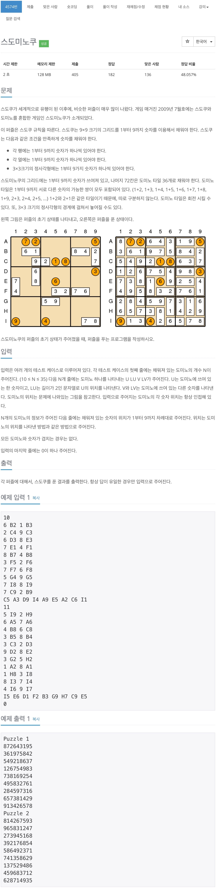
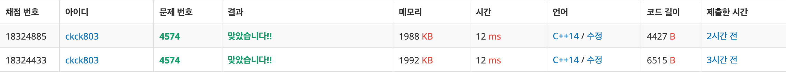

# 스도미노쿠



## 체점 현황



## 풀이 방법

이전에 백준 스도쿠 문제를 풀어봤으면 좀 쉽게 접근할 수 있는 문제이다.  
https://www.acmicpc.net/problem/2580  
기존 `스도쿠 문제` + `백트래킹` 문제이다.    
`group1` => 현재 점에서 입력 가능한 수의 그룹  
`group2` => x+1 점에서 입력 가능한 수의 그룹  
`group3` => y+1 점에서 입력 가능한 수의 그룹  
  
1. `group1`에서 얻은 수들 중 하나의 수를 넣어 준다. 
2. `x+1`에 값을 넣을 수 있는 지 확인하는 알고리즘을 시행
    1. `group1`에서 넣어준 상태에서 `group2`의 수의 그룹을 찾아준다. 
    2. `group2`에서 얻은 수들 중 하나의 수를 선택한 다음
    3. `[group1[i], group2[i]]의 도미노`가 선택되었는지 확인 
    4. `false`일 경우에 넣어준다. 도미노를 선택 
    5. 해당 값을 넣어준다. 
    6. `sudoku(index+1)`을 이용하여 제귀를 돌린다.
    7. 해당 함수에서 빠져나왔을 경우에는 값을 해제해주는 알고리즘을 시행해주어야 한다.
3. `y+1`에 값을 넣을 수 있는 지 확인할 수 있는 알고리즘을 시행
    1. `group1`에서 넣어준 상태에서 `group3`의 수의 그룹을 찾아준다. 
    2. `group3`에서 얻은 수들 중 하나의 수를 선택한 다음
    3. `[group1[i], group2[i]]의 도미노`가 선택되었는지 확인 
    4. `false`일 경우에 넣어준다. 도미노를 선택
    5. 해당 값을 넣어준다.
    6. `sudoku(index+1)`을 이용하여 제귀를 돌린다.
    7. 해당 함수에서 빠져나왔을 경우에는 값을 해제해주는 알고리즘을 시행해주어야 한다.
4. `map[point[index].first][point[index.second]] != 0`일 경우는 x+1이나 y+1에서 이미 값을 집어 넣은 상태이므로 다음으로 넘어갈 수 있게 sudoku(index+1)로 넘겨주었다.


## 스도쿠 알고리즘
```cpp
int y, x;
y = points[index].first;
x = points[index].second;

if (map[y][x] != 0) {
    sudoku(index + 1);
} else {
    vector<int> group1 = findNumber(y, x);
    for (int i = 0; i < group1.size(); i++) {
        // 현재 위치에 값을 넣어준 상태에서 group2 or group3의 숫자 그룹을 찾도록 한다.
        // 안그러면 중복된 값이 나올 수 있다.
        int number1 = group1[i];
        map[y][x] = number1;

        // 가로로 놓기
        if (x + 1 <= 9 && map[y][x + 1] == 0) {
            vector<int> group2 = findNumber(y, x + 1);

            for (int j = 0; j < group2.size(); j++) {
                int number2 = group2[j];

                if (domino[number1][number2] == false) {
                    chooseDomino(number1, number2);
                    map[y][x + 1] = number2;
                    sudoku(index + 1);
                    map[y][x + 1] = 0;
                    releaseDomino(number1, number2);
                }
            }
        }

        // 세로로 놓기
        if (y + 1 <= 9 && map[y + 1][x] == 0) {
            vector<int> group3 = findNumber(y + 1, x);

            for (int j = 0; j < group3.size(); j++) {
                int number2 = group3[j];

                if (domino[number1][number2] == false) {
                    chooseDomino(number1, number2);
                    map[y + 1][x] = number2;
                    sudoku(index + 1);
                    map[y + 1][x] = 0;
                    releaseDomino(number1, number2);
                }
            }
        }
        map[y][x] = 0;
    }
}
```


## 도미노 선택 & 해제

```cpp
void chooseDomino(int num1, int num2) {
    domino[num1][num2] = true;
    domino[num2][num1] = true;
}

void releaseDomino(int num1, int num2) {
    domino[num1][num2] = false;
    domino[num2][num1] = false;
}
```
[num1, num2]의 도미노와 [num2, num1]의 도미노가 같다고 조건에 명시되어 있다.


## 전체 소스 코드

```cpp
#include <iostream>
#include <string>
#include <vector>
using namespace std;

int N;
int map[10][10];
bool domino[10][10];
int total = 0;
int result[10][10];
vector<pair<int, int>> points;

void chooseDomino(int num1, int num2) {
    domino[num1][num2] = true;
    domino[num2][num1] = true;
}

void releaseDomino(int num1, int num2) {
    domino[num1][num2] = false;
    domino[num2][num1] = false;
}

vector<int> findNumber(int y, int x) {
    vector<bool> check(10, false);
    vector<int> numbers;

    // 가로 확인
    for (int i = 1; i <= 9; i++) {
        if (map[y][i] != 0) {
            check[map[y][i]] = true;
        }
    }

    // 세로 확인
    for (int i = 1; i <= 9; i++) {
        if (map[i][x] != 0) {
            check[map[i][x]] = true;
        }
    }

    // 해당 되는 칸을 확인
    int y_1 = y - 1;
    int x_1 = x - 1;
    int rangeY = (y_1 / 3) * 3 + 1;
    int rangeX = (x_1 / 3) * 3 + 1;
    for (int i = rangeY; i < rangeY + 3; i++) {
        for (int j = rangeX; j < rangeX + 3; j++) {
            check[map[i][j]] = true;
        }
    }

    for (int i = 1; i <= 9; i++) {
        if (check[i] == false) {
            numbers.push_back(i);
        }
    }

    return numbers;
}

void sudoku(int index) {
    if (index == points.size()) {
        for (int i = 1; i <= 9; i++) {
            for (int j = 1; j <= 9; j++) {
                result[i][j] = map[i][j];
            }
        }
        return;
    }

    int y, x;
    y = points[index].first;
    x = points[index].second;

    if (map[y][x] != 0) {
        sudoku(index + 1);
    } else {
        vector<int> group1 = findNumber(y, x);
        for (int i = 0; i < group1.size(); i++) {
            // 현재 위치에 값을 넣어준 상태에서 group2 or group3의 숫자 그룹을 찾도록 한다.
            // 안그러면 중복된 값이 나올 수 있다.
            int number1 = group1[i];
            map[y][x] = number1;

            // 가로로 놓기
            if (x + 1 <= 9 && map[y][x + 1] == 0) {
                vector<int> group2 = findNumber(y, x + 1);

                for (int j = 0; j < group2.size(); j++) {
                    int number2 = group2[j];

                    if (domino[number1][number2] == false) {
                        chooseDomino(number1, number2);
                        map[y][x + 1] = number2;
                        sudoku(index + 1);
                        map[y][x + 1] = 0;
                        releaseDomino(number1, number2);
                    }
                }
            }

            // 세로로 놓기
            if (y + 1 <= 9 && map[y + 1][x] == 0) {
                vector<int> group3 = findNumber(y + 1, x);

                for (int j = 0; j < group3.size(); j++) {
                    int number2 = group3[j];

                    if (domino[number1][number2] == false) {
                        chooseDomino(number1, number2);
                        map[y + 1][x] = number2;
                        sudoku(index + 1);
                        map[y + 1][x] = 0;
                        releaseDomino(number1, number2);
                    }
                }
            }
            map[y][x] = 0;
        }
    }
}

int main(void) {
    while (true) {
        total++;
        cin >> N;

        if (N == 0) {
            break;
        }

        for (int i = 0; i < 10; i++) {
            for (int j = 0; j < 10; j++) {
                map[i][j] = 0;
                domino[i][j] = 0;
            }
        }

        for (int i = 0; i < N; i++) {
            int value1;
            string point1;
            int value2;
            string point2;

            cin >> value1 >> point1 >> value2 >> point2;
            map[point1[0] - 'A' + 1][point1[1] - '0'] = value1;
            map[point2[0] - 'A' + 1][point2[1] - '0'] = value2;
            domino[value1][value2] = true;
            domino[value2][value1] = true;
        }

        for (int i = 0; i < 9; i++) {
            string point;
            cin >> point;
            map[point[0] - 'A' + 1][point[1] - '0'] = i + 1;
        }

        vector<pair<int, int>> temp;
        for (int i = 1; i <= 9; i++) {
            for (int j = 1; j <= 9; j++) {
                if (map[i][j] == 0) {
                    temp.push_back({i, j});
                }
            }
        }
        points = temp;
        sudoku(0);

        cout << "Puzzle " << total << '\n';
        for (int i = 1; i <= 9; i++) {
            for (int j = 1; j <= 9; j++) {
                cout << result[i][j];
            }
            cout << endl;
        }
    }

    return 0;
}
```