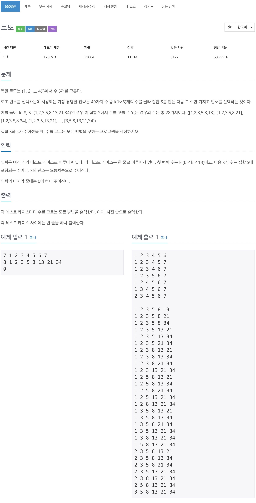

# 백준 6603 - 로또

[6603 - 로또](https://www.acmicpc.net/problem/6603)




## 전체 소스 코드
```cpp
#include <iostream>
using namespace std;

int k;
int number[13];
int lotto[6];

void makeLotto(int start_index, int depth)
{
    if (depth == 6)
    {
        for (int i = 0; i < 6; i++)
            cout << lotto[i] << ' ';
        cout << '\n';
        return;
    }

    for (int i = start_index; i < k; i++)
    {
        int choose_number = number[i];
        lotto[depth] = choose_number;
        makeLotto(i + 1, depth + 1);
    }
}

int main(void)
{
    while (cin >> k && k != 0)
    {
        for (int i = 0; i < k; i++)
            cin >> number[i];

        makeLotto(0, 0);
        cout << endl;
    }
}
```
