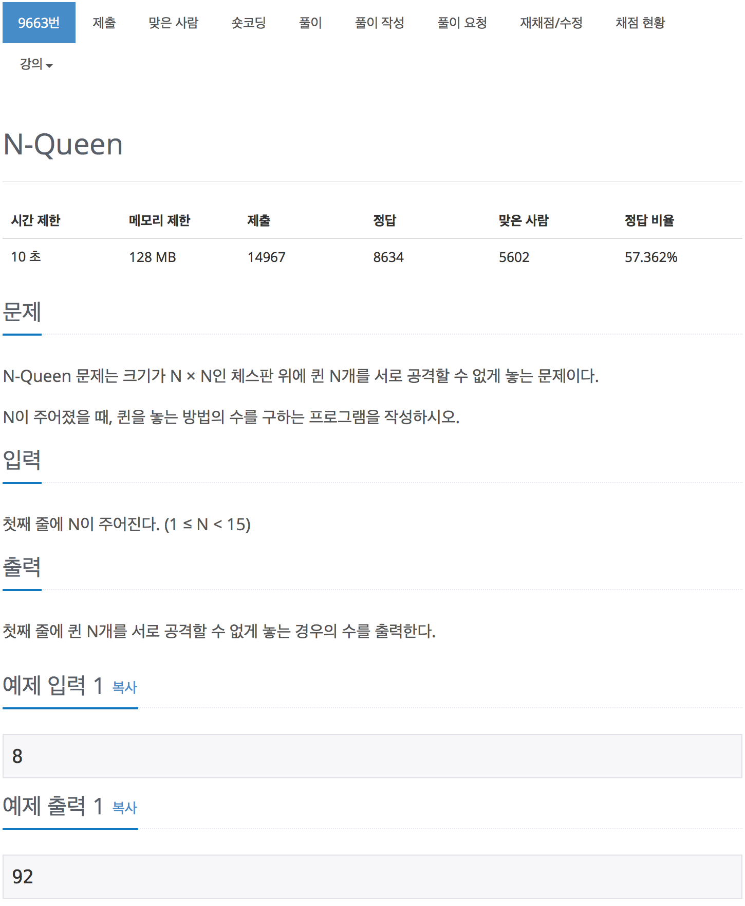

# 백준 9663 N-Queen

[N-Queen](https://www.acmicpc.net/problem/9663)



<br>

## 9663

### 탈출 조건

```cpp
if (row == n)
{
    total++;
    return
}
```

한 행씩 확인하면서 진행한다음에 모든 행을 확인 했을 경우 탈출하게 한다.

<br>

### 유효성 검사

```cpp
for (int i = 0; i < n; i++)
{
    // 열에 대한 유효성 검사
    if (col[i] != false)
    {
        continue;
    }

    bool fp = true;
    // 대각선에 대한 유효성 검사가 들어가야 한다.
    for (int j = 1; j <= row; j++)
    {
        // 왼쪽 대각선에 대한 확인
        if (i - j >= 0)
        {
            if (chess[row - j][i - j] != false)
            {
                fp = false;
            }
        }
        // 오른쪽 대각선에 대한 확인
        if (i + j < n)
        {
            if (chess[row - j][i + j] != false)
            {
                fp = false;
            }
        }
    }

    // 유효성 검사 확인 후
    if (fp)
    {
        chess[row][i] = true;
        col[i] = true;
        nqeen(row + 1);
        col[i] = false;
        chess[row][i] = false;
    }
}
```

<br>

### 전체 소스 코드

```cpp
#include <iostream>
using namespace std;

int n;
// 해당 열에 놓여져 있는지 확인
bool col[16];
bool chess[16][16];
int total;

void nqeen(int row)
{
if (row == n)
{
total++;
return
}

    for (int i = 0; i < n; i++)
    {
        // 열에 대한 유효성 검사
        if (col[i] != false)
        {
            continue;
        }

        bool fp = true;
        // 대각선에 대한 유효성 검사가 들어가야 한다.
        for (int j = 1; j <= row; j++)
        {
            // 왼쪽 대각선에 대한 확인
            if (i - j >= 0)
            {
                if (chess[row - j][i - j] != false)
                {
                    fp = false;
                }
            }
            // 오른쪽 대각선에 대한 확인
            if (i + j < n)
            {
                if (chess[row - j][i + j] != false)
                {
                    fp = false;
                }
            }
        }

        // 유효성 검사 확인 후
        if (fp)
        {
            chess[row][i] = true;
            col[i] = true;
            nqeen(row + 1);
            col[i] = false;
            chess[row][i] = false;
        }
    }

}

int main(void)
{
cin >> n;
nqeen(0);
cout << total << endl;
return 0;
}

```

<br>

## 9663_2 - 한 행씩 진행

```cpp
void nqeen(int cnt_row_index)
{
    if (cnt_row_index == n)
    {
        total++;
        return;
    }

    for (int i = 0; i < n; i++)
    {
        row[cnt_row_index] = i;
        if (isPossible(cnt_row_index))
        {
            nqeen(cnt_row_index + 1);
        }
    }
}
```

<br>

### 유효성 검사

```cpp
bool isPossible(int cnt_row_index)
{
    for (int i = 0; i < cnt_row_index; i++)
    {
        // 기울기 개념을 적용해서 대각선을 검사하였다.
        if (row[i] == row[cnt_row_index] || abs(row[i] - row[cnt_row_index]) == cnt_row_index - i)
            return false;
    }

    return true;
}
```

<br>

### 전체 소스 코드

```cpp
#include <iostream>
using namespace std;

int n;
int row[16];
int total;

bool isPossible(int cnt_row_index)
{
    for (int i = 0; i < cnt_row_index; i++)
    {
        if (row[i] == row[cnt_row_index] || abs(row[i] - row[cnt_row_index]) == cnt_row_index - i)
            return false;
    }

    return true;
}

void nqeen(int cnt_row_index)
{
    if (cnt_row_index == n)
    {
        total++;
        return;
    }

    for (int i = 0; i < n; i++)
    {
        row[cnt_row_index] = i;
        if (isPossible(cnt_row_index))
        {
            nqeen(cnt_row_index + 1);
        }
    }
}

int main(void)
{
    cin >> n;
    nqeen(0);
    cout << total << '\n';
    return 0;
}
```

<br>

## 9663_3 - 한 열씩 진행

```cpp
int nqeen(int i)
{
    if (i == n)
        result++;
    else
    {
        for (int j = 0; j < n; j++)
        {
            col[i] = j;
            if (promising(i))
                nqeen(i + 1);
        }
    }
}
```

<br>

### 유효성 검사

```cpp
bool promising(int i)
{
    for (int j = 0; j < i; j++)
    {
        if (col[j] == col[i] || abs(col[i] - col[j]) == i - j)
            return false;
    }
    return true;
}
```

<br>

## 전체 소스 코드

```cpp
#include <iostream>
using namespace std;

int col[15];
int n;
int result;

bool promising(int i)
{
    for (int j = 0; j < i; j++)
    {
        if (col[j] == col[i] || abs(col[i] - col[j]) == i - j)
            return false;
    }
    return true;
}

int nqeen(int i)
{
    if (i == n)
        result++;
    else
    {
        for (int j = 0; j < n; j++)
        {
            col[i] = j;
            if (promising(i))
                nqeen(i + 1);
        }
    }
}

int main(void)
{
    cin >> n;
    nqeen(0);
    cout << result << endl;
    return 0;
}
```
