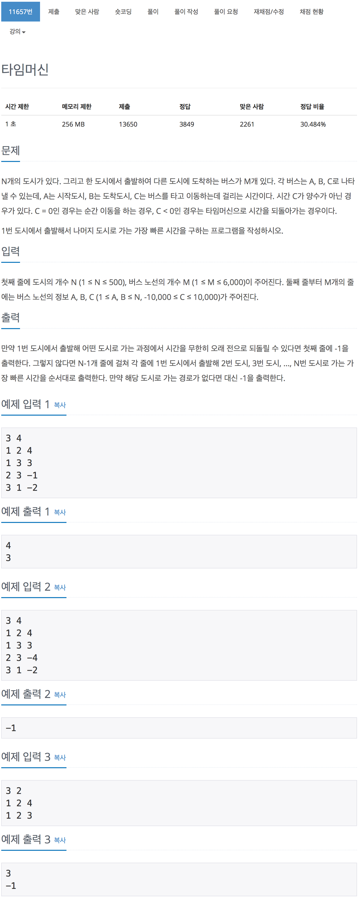

# 백준 11657 - 타임머신

[11657 - 타임머신](https://www.acmicpc.net/problem/11657)



```cpp
for (int i = 0; i < M; i++)
{
    // 시작, 끝, 가중치
    int A, B, C;
    scanf("%d %d %d", &A, &B, &C);
    v[A].push_back({B, C});
}
for (int i = 1; i <= N; i++)
    dist[i] = INF;
```

```cpp
dist[1] = 0;
for (int i = 1; i <= N; i++)
{
    for (int j = 1; j <= N; j++)
    {
        for (int k = 0; k < v[j].size(); k++)
        {
            pair<int, int> n = v[j][k];
            int n_node = n.first;
            int j_n_weight = n.second;

            if (dist[j] != INF && dist[n_node] > dist[j] + j_n_weight)
            {
                dist[n_node] = dist[j] + j_n_weight;
                if (i == N)
                    cycle = true;
            }
        }
    }
}
```

```cpp
#include <iostream>
#include <vector>
using namespace std;

#define INF 987654321

int main(void)
{
    int N, M;
    int dist[502];
    bool cycle = false;
    vector<pair<int, int>> v[502];

    scanf("%d %d ", &N, &M);
    for (int i = 0; i < M; i++)
    {
        // 시작, 끝, 가중치
        int A, B, C;
        scanf("%d %d %d", &A, &B, &C);
        v[A].push_back({B, C});
    }
    for (int i = 1; i <= N; i++)
        dist[i] = INF;

    dist[1] = 0;
    for (int i = 1; i <= N; i++)
    {
        for (int j = 1; j <= N; j++)
        {
            for (int k = 0; k < v[j].size(); k++)
            {
                pair<int, int> n = v[j][k];
                int n_node = n.first;
                int j_n_weight = n.second;

                if (dist[j] != INF && dist[n_node] > dist[j] + j_n_weight)
                {
                    dist[n_node] = dist[j] + j_n_weight;
                    if (i == N)
                        cycle = true;
                }
            }
        }
    }

    if (cycle)
        printf("-1\n");
    else
    {
        for (int i = 2; i <= N; i++)
            if (dist[i] == INF)
                printf("-1\n");
            else
            {
                printf("%d\n", dist[i]);
            }
    }
}
```
