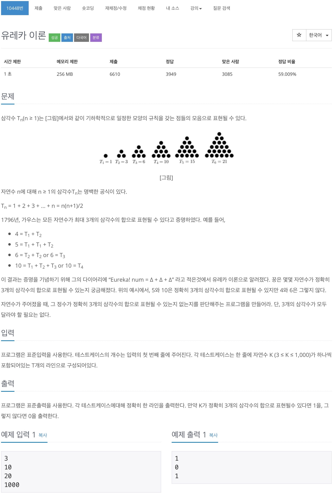

# 백준 - 10448 - 유레카 이론



## 전체 소스 코드
```cpp
#include <iostream>
using namespace std;

int TestCase;
int K;
int arr[1001];
int isTrue = false;

void findNum(int N, int num) {
    if (isTrue == true) {
        return;
    }

    if (num > 3) {
        return;
    }

    if (N == 0 && num == 3) {
        isTrue = true;
        return;
    }

    for (int i = 1; i * (i + 1) < 2 * K; i++) {
        findNum(N - arr[i], num + 1);
    }
}

int main(void) {
    for (int i = 1; i * (i + 1) <= 2000; i++) {
        arr[i] = (i * (i + 1)) / 2;
    }

    cin >> TestCase;
    while (TestCase--) {
        isTrue = false;

        cin >> K;
        findNum(K, 0);

        if (isTrue) {
            cout << 1 << '\n';
        } else {
            cout << 0 << '\n';
        }
    }

    return 0;
}
```