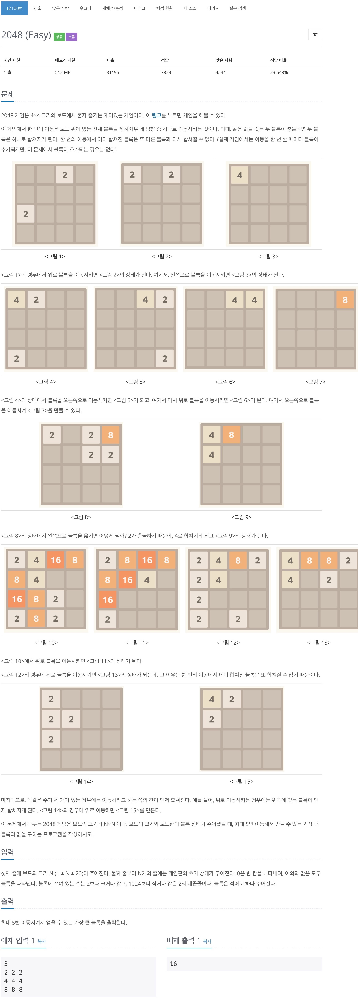

# 백준 12100 - 2048(easy)



## 전체 소스 코드
```cpp
#include <iostream>
#include <vector>
using namespace std;

int N;
int maxValue;
int board[22][22];

void moveLeft() {
    for (int k = 0; k < N; k++) {
        for (int j = 1; j < N; j++) {
            for (int i = 0; i < N; i++) {
                int next = j - 1;

                if (board[i][next] == 0) {
                    board[i][next] = board[i][j];
                    board[i][j] = 0;
                }
            }
        }
    }

    vector<vector<bool>> check(N, vector<bool>(N, false));
    for (int j = 1; j < N; j++) {
        for (int i = 0; i < N; i++) {
            int next = j - 1;

            if (board[i][next] == board[i][j]) {
                if (!check[i][next] && !check[i][j]) {
                    board[i][next] += board[i][j];
                    board[i][j] = 0;

                    check[i][next] = true;
                    check[i][j] = true;
                }
            }
        }
    }

    for (int k = 0; k < N; k++) {
        for (int j = 1; j < N; j++) {
            for (int i = 0; i < N; i++) {
                int next = j - 1;

                if (board[i][next] == 0) {
                    board[i][next] = board[i][j];
                    board[i][j] = 0;
                }
            }
        }
    }
}

void moveRight() {
    for (int k = 0; k < N; k++) {
        for (int j = N - 2; j >= 0; j--) {
            for (int i = 0; i < N; i++) {
                int next = j + 1;

                if (board[i][next] == 0) {
                    board[i][next] = board[i][j];
                    board[i][j] = 0;
                }
            }
        }
    }

    vector<vector<bool>> check(N, vector<bool>(N, false));
    for (int j = N - 2; j >= 0; j--) {
        for (int i = 0; i < N; i++) {
            int next = j + 1;

            if (board[i][next] == board[i][j]) {
                if (!check[i][next] && !check[i][j]) {
                    board[i][next] += board[i][j];
                    board[i][j] = 0;

                    check[i][next] = true;
                    check[i][j] = true;
                }
            }
        }
    }

    for (int k = 0; k < N; k++) {
        for (int j = N - 2; j >= 0; j--) {
            for (int i = 0; i < N; i++) {
                int next = j + 1;

                if (board[i][next] == 0) {
                    board[i][next] = board[i][j];
                    board[i][j] = 0;
                }
            }
        }
    }
}

void moveUp() {
    for (int k = 0; k < N; k++) {
        for (int i = 1; i < N; i++) {
            for (int j = 0; j < N; j++) {
                int next = i - 1;

                if (board[next][j] == 0) {
                    board[next][j] = board[i][j];
                    board[i][j] = 0;
                }
            }
        }
    }

    vector<vector<bool>> check(N, vector<bool>(N, false));
    for (int i = 1; i < N; i++) {
        for (int j = 0; j < N; j++) {
            int next = i - 1;

            if (board[next][j] == board[i][j]) {
                if (!check[next][j] && !check[i][j]) {
                    board[next][j] += board[i][j];
                    board[i][j] = 0;

                    check[next][j] = true;
                    check[i][j] = true;
                }
            }
        }
    }

    for (int k = 0; k < N; k++) {
        for (int i = 1; i < N; i++) {
            for (int j = 0; j < N; j++) {
                int next = i - 1;

                if (board[next][j] == 0) {
                    board[next][j] = board[i][j];
                    board[i][j] = 0;
                }
            }
        }
    }
}

void moveDown() {
    for (int k = 0; k < N; k++) {
        for (int i = N - 2; i >= 0; i--) {
            for (int j = 0; j < N; j++) {
                int next = i + 1;

                if (board[next][j] == 0) {
                    board[next][j] = board[i][j];
                    board[i][j] = 0;
                }
            }
        }
    }

    vector<vector<bool>> check(N, vector<bool>(N, false));
    for (int i = N - 2; i >= 0; i--) {
        for (int j = 0; j < N; j++) {
            int next = i + 1;

            if (board[next][j] == board[i][j]) {
                if (!check[next][j] && !check[i][j]) {
                    board[next][j] += board[i][j];
                    board[i][j] = 0;

                    check[next][j] = true;
                    check[i][j] = true;
                }
            }
        }
    }

    for (int k = 0; k < N; k++) {
        for (int i = N - 2; i >= 0; i--) {
            for (int j = 0; j < N; j++) {
                int next = i + 1;

                if (board[next][j] == 0) {
                    board[next][j] = board[i][j];
                    board[i][j] = 0;
                }
            }
        }
    }
}

void dfs(int depth) {
    if (depth == 5) {
        for (int i = 0; i < N; i++) {
            for (int j = 0; j < N; j++) {
                if (maxValue < board[i][j]) {
                    maxValue = board[i][j];
                }
            }
        }
        return;
    }

    int tempBoard[22][22];
    for (int i = 0; i < N; i++) {
        for (int j = 0; j < N; j++) {
            tempBoard[i][j] = board[i][j];
        }
    }

    moveLeft();
    dfs(depth + 1);
    for (int i = 0; i < N; i++) {
        for (int j = 0; j < N; j++) {
            board[i][j] = tempBoard[i][j];
        }
    }

    moveRight();
    dfs(depth + 1);
    for (int i = 0; i < N; i++) {
        for (int j = 0; j < N; j++) {
            board[i][j] = tempBoard[i][j];
        }
    }

    moveUp();
    dfs(depth + 1);
    for (int i = 0; i < N; i++) {
        for (int j = 0; j < N; j++) {
            board[i][j] = tempBoard[i][j];
        }
    }

    moveDown();
    dfs(depth + 1);
    for (int i = 0; i < N; i++) {
        for (int j = 0; j < N; j++) {
            board[i][j] = tempBoard[i][j];
        }
    }
}

int main(void) {
    cin >> N;

    for (int i = 0; i < N; i++) {
        for (int j = 0; j < N; j++) {
            cin >> board[i][j];
        }
    }

    dfs(0);
    cout << maxValue << endl;
    return 0;
}
```