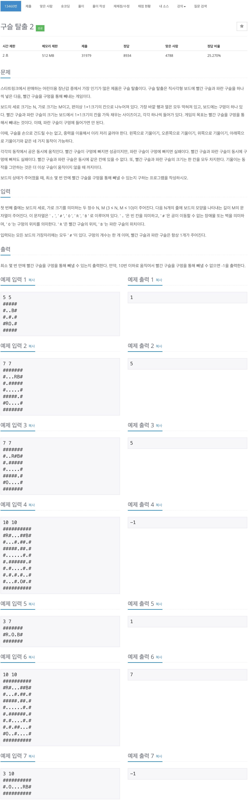

# 백준 13460 - 구슬 탈출2



## 체점 현황


## 1. 틀린 이유

```cpp
beads.count = 0;
q.push(beads);
```

큐에 첫번째 위치를 넣으면서 `check`를 안해주어서 틀리게 되었다.

## 해설

문제 조건대로 판을 기울이면서 구슬을 굴리는 문제이다. 다만 기존의 `bfs`문제와는 다르게 한번 판이 기울게 되면 벽을 만날때까지 구슬이 굴러가게 된다는 점이다. 이 부분은 `while`문을 이용해서 처리를 해주었고, 구슬이 굴러가는 방향에 파란 구슬과 빨간 구슬이 나란히 있는 상황도 고려해 주어야 하므로 예외처리를 통해 구현해주어야 한다.
파란구슬과 빨간구슬의 공통점은 상, 하, 좌, 우로 굴러간다는 공통점이 있으므로 이 부분은 함수를 이용하여 처리한다.

## 구슬

```cpp
struct Beads {
    int redX;
    int redY;
    int blueX;
    int blueY;
    int count;
};
```

빨간 구슬과 파란 구슬의 위치를 동시에 저장하기 위해서 구조체를 이용하여 묶었다.

## 구슬 굴리기

```cpp
void moveBead(int& y, int& x, int d) {
    while (1) {
        x += dx[d];
        y += dy[d];

        if (map[y][x] == '#') {
            x -= dx[d];
            y -= dy[d];
            break;
        } else if (map[y][x] == 'O') {
            break;
        }
    }
}
```

구슬이 벽을 만나기 전까지 while문을 통해서 계속 구슬을 굴린다. 만약, 현재의 위치가 벽의 위치일경우 뒤로 물러난 다음에 break를 통해 빠져나게 한다. 만약 O을 만나는 경우 break를 통해 반환한다.

## 굴린 후 예외 처리

```cpp
if (map[bny][bnx] == 'O')
    continue;


if (rny == bny && rnx == bnx) {
    if (i == 0) {
        if (blueX < redX) {
            bnx--;
        } else {
            rnx--;
        }
    } else if (i == 1) {
        if (blueY < redY) {
            bny--;
        } else {
            rny--;
        }

    } else if (i == 2) {
        if (blueX < redX) {
            rnx++;
        } else {
            bnx++;
        }
    } else {
        if (blueY < redY) {
            rny++;
        } else {
            bny++;
        }
    }
}
```

`blue` 구슬이 `O`을 만나게 되는 경우 빠져나오게 한다.  
`red`구슬과 `blue`구슬이 겹치게 되는 경우에는 원래 있던 구슬의 위치를 확인한 다음 뒤에 있던 구슬을 한칸 뒤로 움직이게 한다.

## 전체 코드

```cpp
#include <iostream>
#include <queue>
using namespace std;

int N, M;
char map[11][11];
char check[11][11];
int dx[4] = {1, 0, -1, 0};
int dy[4] = {0, 1, 0, -1};

struct Beads {
    int redX;
    int redY;
    int blueX;
    int blueY;
    int count;
};
bool visited[11][11][11][11];

queue<Beads> q;

void moveBead(int& y, int& x, int d) {
    while (1) {
        x += dx[d];
        y += dy[d];

        if (map[y][x] == '#') {
            x -= dx[d];
            y -= dy[d];
            break;
        } else if (map[y][x] == 'O') {
            break;
        }
    }
}

int main(void) {
    cin >> N >> M;

    Beads beads;
    for (int i = 0; i < N; i++) {
        for (int j = 0; j < M; j++) {
            cin >> map[i][j];

            if (map[i][j] == 'R') {
                beads.redY = i;
                beads.redX = j;
                map[i][j] = '.';
            }

            if (map[i][j] == 'B') {
                beads.blueY = i;
                beads.blueX = j;
                map[i][j] = '.';
            }
        }
    }
    beads.count = 0;
    q.push(beads);
    visited[beads.redX][beads.redY][beads.blueX][beads.blueY] = true;

    while (!q.empty()) {
        int redY = q.front().redY;
        int redX = q.front().redX;
        int blueY = q.front().blueY;
        int blueX = q.front().blueX;
        int count = q.front().count;
        q.pop();

        if (count > 10) {
            cout << -1 << endl;
            return 0;
        }

        if (map[redY][redX] == 'O') {
            cout << count << '\n';
            return 0;
        }

        for (int i = 0; i < 4; i++) {
            int rny = redY;
            int rnx = redX;
            int bny = blueY;
            int bnx = blueX;
            int cnt = count + 1;

            moveBead(rny, rnx, i);
            moveBead(bny, bnx, i);

            if (map[bny][bnx] == 'O')
                continue;

            if (rny == bny && rnx == bnx) {
                if (i == 0) {
                    if (blueX < redX) {
                        bnx--;
                    } else {
                        rnx--;
                    }
                } else if (i == 1) {
                    if (blueY < redY) {
                        bny--;
                    } else {
                        rny--;
                    }

                } else if (i == 2) {
                    if (blueX < redX) {
                        rnx++;
                    } else {
                        bnx++;
                    }
                } else {
                    if (blueY < redY) {
                        rny++;
                    } else {
                        bny++;
                    }
                }
            }

            if (!visited[rnx][rny][bnx][bny]) {
                Beads temp = {rnx, rny, bnx, bny, count + 1};
                q.push(temp);
                visited[rnx][rny][bnx][bny] = true;
            }
        }
    }
    cout << -1 << '\n';
    return 0;
}
```
