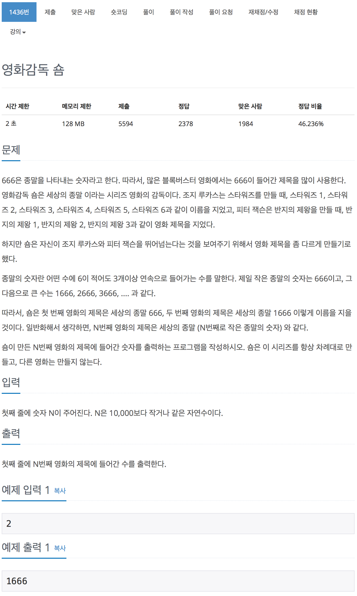

# 백준 1436 - 영화감독 슘

[1436 - 영화 감독 슘](https://www.acmicpc.net/problem/1436)



```cpp
#include <iostream>
using namespace std;

int n;
int arr[100001];

int main(void)
{
    scanf("%d", &n);

    int index = 1;
    int cnt = 666;

    while (index <= n)
    {
        int num = cnt;

        while (num >= 666)
        {
            if (num % 10 == 6)
            {
                num /= 10;
                if (num % 10 == 6)
                {
                    num /= 10;
                    if (num % 10 == 6)
                    {
                        arr[index] = cnt;
                        index++;
                        break;
                    }
                }
            }
            else
            {
                num /= 10;
            }
        }
        cnt++;
    }

    printf("%d\n", arr[n]);
    return 0;
}
```
