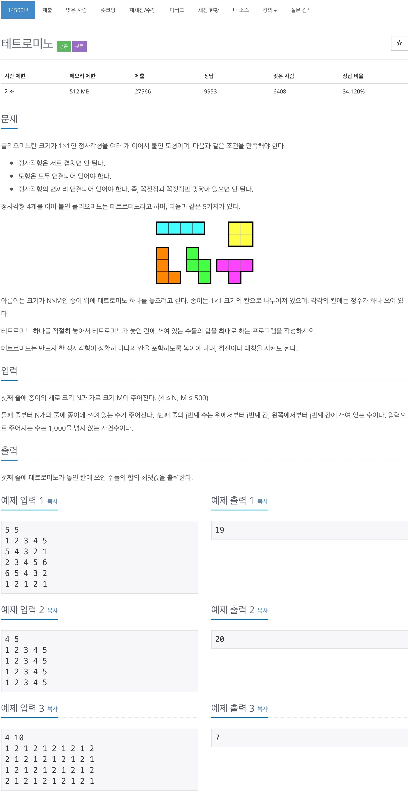

# 백준 14500 - 테트로미노



## 전체 소스 코드
```cpp
#include <iostream>
using namespace std;

int N, M;
int arr[505][505];
int dx[4] = {1, -1, 0, 0};
int dy[4] = {0, 0, 1, -1};
int check[505][505];
int maxValue;

void calculate2(int y, int x) {
    if (y - 1 >= 0 && y + 1 < N && x + 1 < M) {
        int sum = arr[y][x] + arr[y - 1][x] + arr[y][x + 1] + arr[y + 1][x];
        maxValue = max(maxValue, sum);
    }

    if (y + 1 < N && x - 1 >= 0 && x + 1 < M) {
        int sum = arr[y][x] + arr[y + 1][x] + arr[y][x - 1] + arr[y][x + 1];
        maxValue = max(maxValue, sum);
    }
    if (x - 1 >= 0 && y - 1 >= 0 && y + 1 < N) {
        int sum = arr[y][x] + arr[y][x - 1] + arr[y - 1][x] + arr[y + 1][x];
        maxValue = max(maxValue, sum);
    }
    if (x - 1 >= 0 && x + 1 < M && y - 1 >= 0) {
        int sum = arr[y][x] + arr[y][x - 1] + arr[y][x + 1] + arr[y - 1][x];
        maxValue = max(maxValue, sum);
    }
}

void calculate1(int y, int x, int sum, int depth) {
    if (depth == 4) {
        maxValue = max(maxValue, sum);
        return;
    }

    for (int i = 0; i < 4; i++) {
        int ny = y + dy[i];
        int nx = x + dx[i];

        if (0 <= ny && ny < N && 0 <= nx && nx < M) {
            if (check[ny][nx] == false) {
                check[ny][nx] = true;
                calculate1(ny, nx, sum + arr[ny][nx], depth + 1);
                check[ny][nx] = false;
            }
        }
    }
}

int main(void) {
    cin >> N >> M;

    for (int i = 0; i < N; i++) {
        for (int j = 0; j < M; j++) {
            cin >> arr[i][j];
        }
    }

    for (int i = 0; i < N; i++) {
        for (int j = 0; j < M; j++) {
            check[i][j] = true;
            calculate1(i, j, arr[i][j], 1);
            check[i][j] = false;
            calculate2(i, j);
        }
    }

    cout << maxValue << '\n';
    return 0;
}
```