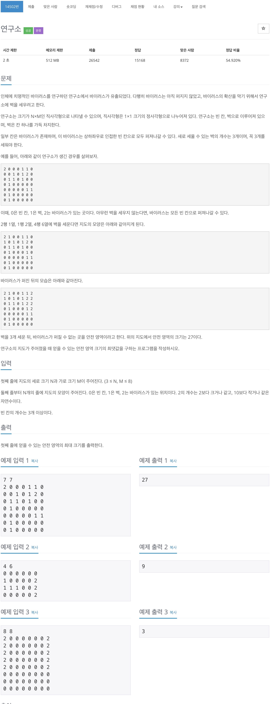

# 백준 14502 - 연구소

[14502 - 연구소](https://www.acmicpc.net/problem/14502)



## 전체 소스 코드
```cpp
#include <iostream>
#include <queue>
using namespace std;

#define endl '\n'

// 입력
// 첫째 줄에 지도의 세로 크기 N과 가로 크기 M이 주어진다. (3 ≤ N, M ≤ 8)
// 둘째 줄부터 N개의 줄에 지도의 모양이 주어진다.
// 0은 빈 칸, 1은 벽, 2는 바이러스가 있는 위치이다. 2의 개수는 2보다 크거나
// 같고, 10보다 작거나 같은 자연수이다. 빈 칸의 개수는 3개 이상이다.

// 출력
// 첫째 줄에 얻을 수 있는 안전 영역의 최대 크기를 출력한다.

int N, M;
int map[10][10];
int maxArea;
int dx[4] = {1, 0, -1, 0};
int dy[4] = {0, -1, 0, 1};

void spreadVirus() {
    int copyMap[10][10];
    int area = 0;
    queue<pair<int, int>> q;

    for (int i = 0; i < N; i++) {
        for (int j = 0; j < M; j++) {
            copyMap[i][j] = map[i][j];
            if (copyMap[i][j] == 2) {
                q.push({i, j});
            }
        }
    }

    while (!q.empty()) {
        int y = q.front().first;
        int x = q.front().second;
        q.pop();

        for (int i = 0; i < 4; i++) {
            int ny = y + dy[i];
            int nx = x + dx[i];

            if (0 <= ny && ny < N && 0 <= nx && nx < M) {
                if (copyMap[ny][nx] == 0) {
                    copyMap[ny][nx] = 2;
                    q.push({ny, nx});
                }
            }
        }
    }

    for (int i = 0; i < N; i++) {
        for (int j = 0; j < M; j++) {
            if (copyMap[i][j] == 0) {
                area++;
            }
        }
    }

    if (area > maxArea) {
        maxArea = area;
    }
}

void makeWall(int level) {
    if (level == 3) {
        spreadVirus();
        return;
    }

    for (int i = 0; i < N; i++) {
        for (int j = 0; j < M; j++) {
            if (map[i][j] == 0) {
                map[i][j] = 1;
                makeWall(level + 1);
                map[i][j] = 0;
            }
        }
    }
}

int main(void) {
    cin >> N >> M;

    for (int i = 0; i < N; i++) {
        for (int j = 0; j < M; j++) {
            cin >> map[i][j];
        }
    }

    makeWall(0);

    cout << maxArea << endl;
}
```
