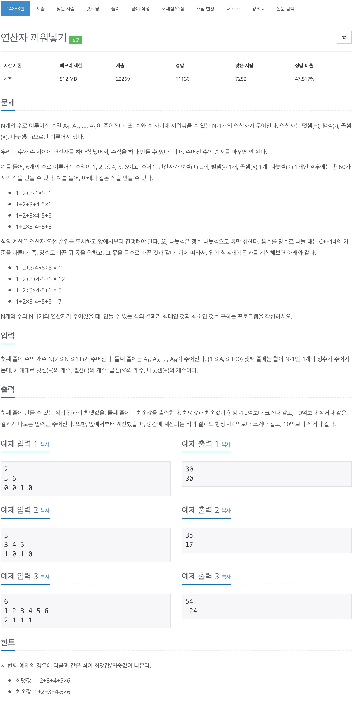

# 백준 14888 - 연산자 끼워넣기



## 전체 소스 코드
```cpp
#include <iostream>
#include <string>
#include <vector>
using namespace std;

int N;
int arr[101];
int oper[4];
char op[4] = {'+', '-', '*', '/'};
vector<string> exp;
int maxValue = -1000000000, minValue = 1000000000;

void calculate() {
    for (int i = 0; i < exp.size(); i++) {
        string cntExp = exp[i];

        int cntValue = arr[0];
        for (int i = 0; i < cntExp.size(); i++) {
            if (cntExp[i] == '+') {
                cntValue += arr[i + 1];
            } else if (cntExp[i] == '-') {
                cntValue -= arr[i + 1];
            } else if (cntExp[i] == '*') {
                cntValue *= arr[i + 1];
            } else {
                cntValue /= arr[i + 1];
            }
        }

        if (maxValue < cntValue) {
            maxValue = cntValue;
        }

        if (minValue > cntValue) {
            minValue = cntValue;
        }
    }

    cout << maxValue << '\n';
    cout << minValue << '\n';
}

void makeOperation(int num, string s) {
    if (num == N - 1) {
        exp.push_back(s);
    }

    for (int i = 0; i < 4; i++) {
        if (oper[i] == 0) {
            continue;
        }

        oper[i]--;
        makeOperation(num + 1, s + op[i]);
        oper[i]++;
    }
}

int main(void) {
    cin >> N;

    for (int i = 0; i < N; i++) {
        cin >> arr[i];
    }

    for (int i = 0; i < 4; i++) {
        cin >> oper[i];
    }

    makeOperation(0, "");
    calculate();

    return 0;
}
```