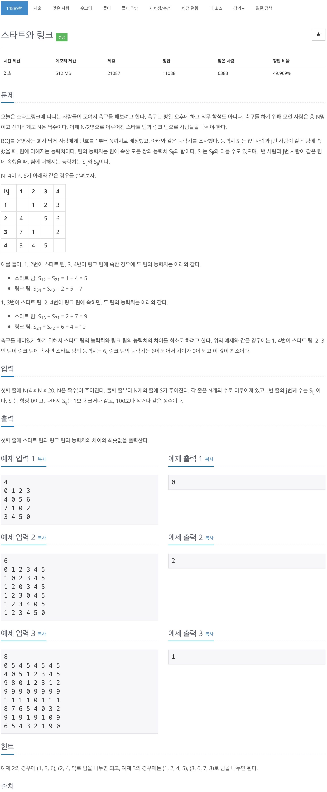
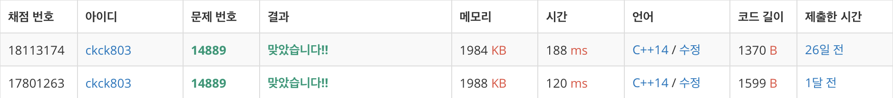

# 백준 14889 - 스타트와 링크


## 체점 현황




## 전체 소스 코드
```cpp
#include <iostream>
using namespace std;

int n;
int arr[22][22];
int minDist = 1000000000;
bool team[22];

void findTeam(int index, int num) {
    if (num == n / 2) {
        int totalTrue = 0;
        int totalFalse = 0;
        for (int i = 1; i <= n; i++) {
            if (team[i] == true) {
                for (int j = 1; j <= n; j++) {
                    if (i == j) {
                        continue;
                    }

                    if (team[j] == true) {
                        totalTrue += arr[i][j];
                    }
                }
            } else {
                for (int j = 1; j <= n; j++) {
                    if (i == j) {
                        continue;
                    }

                    if (team[j] == false) {
                        totalFalse += arr[i][j];
                    }
                }
            }
        }

        if (minDist > abs(totalTrue - totalFalse)) {
            minDist = abs(totalTrue - totalFalse);
        }

        return;
    }

    for (int i = index; i <= n; i++) {
        team[i] = true;
        findTeam(i + 1, num + 1);
        team[i] = false;
    }
}

int main(void) {
    cin >> n;
    for (int i = 1; i <= n; i++) {
        for (int j = 1; j <= n; j++) {
            cin >> arr[i][j];
        }
    }

    findTeam(1, 0);

    cout << minDist << '\n';

    return 0;
}
```