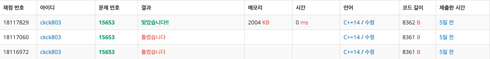

# 백준 15653 - 구슬 탈출 4


## 체점 현황


## 풀이 방법
구슬 탈출 2와 별 차이가 없는 거 같다. 그냥 더 이상 진행할 경우가 없으면 `-1`로 반환하고 끝내면 되는 거 같다.

## 구슬
```cpp
struct Bead {
    int y;
    int x;

    bool operator==(Bead bead) {
        return (this->y == bead.y) && (this->x == bead.x);
    }
};
```
비교 연산을 해주어야 하기 때문에 연산자 오버로딩을 사용하였다.

## 구슬 굴리기
```cpp
void moveBead(Bead& bead, int dir) {
    while (true) {
        bead.y += dy[dir];
        bead.x += dx[dir];

        if (board[bead.y][bead.x] == '#') {
            bead.y -= dy[dir];
            bead.x -= dx[dir];
            break;
        }

        if (board[bead.y][bead.x] == 'O') {
            break;
        }
    }
}
```
구슬을 굴리디가 벽`#`을 만나는 경우에는 진전값을 반환하게 했고, 탈출구`O`을 만나는 경우에는 그냥 반환하게 했다.


## 예외 처리
```cpp
if (board[nextBlue.y][nextBlue.x] == 'O') {
    continue;
}

if (nextRed == nextBlue) {
    // 동
    if (i == 0) {
        if (cntRed.x < cntBlue.x) {
            nextRed.x--;
        } else {
            nextBlue.x--;
        }
    }

    // 서
    if (i == 1) {
        if (cntRed.x < cntBlue.x) {
            nextBlue.x++;
        } else {
            nextRed.x++;
        }
    }

    // 남
    if (i == 2) {
        if (cntRed.y < cntBlue.y) {
            nextRed.y--;
        } else {
            nextBlue.y--;
        }
    }

    // 북
    if (i == 3) {
        if (cntRed.y < cntBlue.y) {
            nextBlue.y++;
        } else {
            nextRed.y++;
        }
    }
}
```
결국 예외 처리가 관건이 된거 같다. 구슬을 굴리다가 파란구슬이 먼저 탈출하거나 동시에 탈출하는 경우에는 더 이상 진행할 필요가 없으므로 자르면 된다. 만약 굴린 후 빨간 구슬과 파란 구슬이 겹치는 경우에는 굴리는 방향에 따라 빨간 구슬과 파란 구슬의 선후관계를 따진 후에 뒤에 있는 구슬을 찾아 한칸 뒤로 보낸다.

## 전체 소스 코드
```cpp
#include <bits/stdc++.h>
using namespace std;

int N, M;
char board[11][11];
struct Bead {
    int y;
    int x;

    bool operator==(Bead bead) {
        return (this->y == bead.y) && (this->x == bead.x);
    }
};
bool check[11][11][11][11];
// 순서는 동, 서, 남, 북
int dx[4] = {1, -1, 0, 0};
int dy[4] = {0, 0, 1, -1};

void moveBead(Bead& bead, int dir) {
    while (true) {
        bead.y += dy[dir];
        bead.x += dx[dir];

        if (board[bead.y][bead.x] == '#') {
            bead.y -= dy[dir];
            bead.x -= dx[dir];
            break;
        }

        if (board[bead.y][bead.x] == 'O') {
            break;
        }
    }
}

int main(void) {
    cin >> N >> M;
    Bead red, blue;

    for (int i = 0; i < N; i++) {
        for (int j = 0; j < M; j++) {
            cin >> board[i][j];

            if (board[i][j] == 'R') {
                red.y = i;
                red.x = j;
            }

            if (board[i][j] == 'B') {
                blue.y = i;
                blue.x = j;
            }
        }
    }

    queue<pair<Bead, Bead>> q;
    q.push({red, blue});
    check[red.y][red.x][blue.y][blue.x] = true;

    int cnt = 0;
    while (!q.empty()) {
        int q_size = q.size();

        while (q_size--) {
            Bead cntRed = q.front().first;
            Bead cntBlue = q.front().second;
            q.pop();

            if (board[cntRed.y][cntRed.x] == 'O') {
                cout << cnt << '\n';
                return 0;
            }

            for (int i = 0; i < 4; i++) {
                Bead nextRed = cntRed;
                Bead nextBlue = cntBlue;

                moveBead(nextRed, i);
                moveBead(nextBlue, i);

                if (board[nextBlue.y][nextBlue.x] == 'O') {
                    continue;
                }

                if (nextRed == nextBlue) {
                    // 동
                    if (i == 0) {
                        if (cntRed.x < cntBlue.x) {
                            nextRed.x--;
                        } else {
                            nextBlue.x--;
                        }
                    }

                    // 서
                    if (i == 1) {
                        if (cntRed.x < cntBlue.x) {
                            nextBlue.x++;
                        } else {
                            nextRed.x++;
                        }
                    }

                    // 남
                    if (i == 2) {
                        if (cntRed.y < cntBlue.y) {
                            nextRed.y--;
                        } else {
                            nextBlue.y--;
                        }
                    }

                    // 북
                    if (i == 3) {
                        if (cntRed.y < cntBlue.y) {
                            nextBlue.y++;
                        } else {
                            nextRed.y++;
                        }
                    }
                }

                if (!check[nextRed.y][nextRed.x][nextBlue.y][nextBlue.x]) {
                    check[nextRed.y][nextRed.x][nextBlue.y][nextBlue.x] = true;
                    q.push({nextRed, nextBlue});
                }
            }
        }
        cnt++;
    }

    cout << -1 << '\n';
    return 0;
}
```