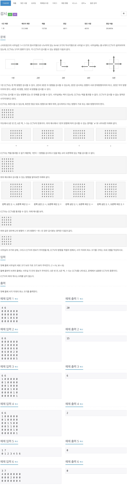
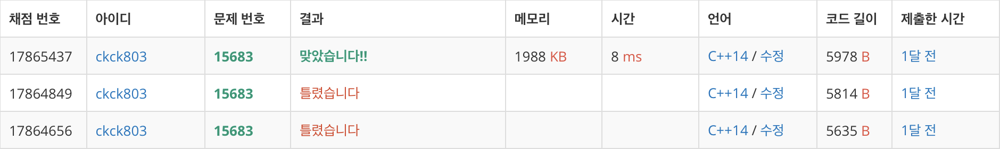

# 백준 15683 - 구슬 탈출 4



## 체점 현황



## 전체 소스 코드
```cpp
#include <iostream>
#include <vector>
using namespace std;

int N, M;
char arr[9][9];
int cctvNum;
int minValue = 100;
vector<pair<int, int>> cctv;

void seeLeft(int y, int x) {
    for (int i = x - 1; i >= 0; i--) {
        if (arr[y][i] == '6') {
            break;
        } else if ('1' <= arr[y][i] && arr[y][i] <= '5') {
            continue;
        } else {
            arr[y][i] = '#';
        }
    }
}

void seeRight(int y, int x) {
    for (int i = x + 1; i < M; i++) {
        if (arr[y][i] == '6') {
            break;
        } else if ('1' <= arr[y][i] && arr[y][i] <= '5') {
            continue;
        } else {
            arr[y][i] = '#';
        }
    }
}

void seeUp(int y, int x) {
    for (int i = y - 1; i >= 0; i--) {
        if (arr[i][x] == '6') {
            break;
        } else if ('1' <= arr[i][x] && arr[i][x] <= '5') {
            continue;
        } else {
            arr[i][x] = '#';
        }
    }
}

void seeDown(int y, int x) {
    for (int i = y + 1; i < N; i++) {
        if (arr[i][x] == '6') {
            break;
        } else if ('1' <= arr[i][x] && arr[i][x] <= '5') {
            continue;
        } else {
            arr[i][x] = '#';
        }
    }
}

void selectCctv(int depth) {
    if (depth == cctvNum) {
        int sum = 0;

        for (int i = 0; i < N; i++) {
            for (int j = 0; j < M; j++) {
                if (arr[i][j] == '0')
                    sum++;
            }
        }

        if (minValue > sum) {
            minValue = sum;
        }
        return;
    }

    pair<int, int> cnt = cctv[depth];
    int y = cnt.first;
    int x = cnt.second;

    char preCctv[9][9];
    for (int i = 0; i < N; i++) {
        for (int j = 0; j < M; j++) {
            preCctv[i][j] = arr[i][j];
        }
    }

    if (arr[y][x] == '1') {
        seeLeft(y, x);
        selectCctv(depth + 1);
        for (int i = 0; i < N; i++) {
            for (int j = 0; j < M; j++) {
                arr[i][j] = preCctv[i][j];
            }
        }

        seeRight(y, x);
        selectCctv(depth + 1);
        for (int i = 0; i < N; i++) {
            for (int j = 0; j < M; j++) {
                arr[i][j] = preCctv[i][j];
            }
        }

        seeUp(y, x);
        selectCctv(depth + 1);
        for (int i = 0; i < N; i++) {
            for (int j = 0; j < M; j++) {
                arr[i][j] = preCctv[i][j];
            }
        }

        seeDown(y, x);
        selectCctv(depth + 1);
        for (int i = 0; i < N; i++) {
            for (int j = 0; j < M; j++) {
                arr[i][j] = preCctv[i][j];
            }
        }

    } else if (arr[y][x] == '2') {
        seeUp(y, x);
        seeDown(y, x);
        selectCctv(depth + 1);
        for (int i = 0; i < N; i++) {
            for (int j = 0; j < M; j++) {
                arr[i][j] = preCctv[i][j];
            }
        }

        seeRight(y, x);
        seeLeft(y, x);
        selectCctv(depth + 1);
        for (int i = 0; i < N; i++) {
            for (int j = 0; j < M; j++) {
                arr[i][j] = preCctv[i][j];
            }
        }

    } else if (arr[y][x] == '3') {
        seeUp(y, x);
        seeRight(y, x);
        selectCctv(depth + 1);
        for (int i = 0; i < N; i++) {
            for (int j = 0; j < M; j++) {
                arr[i][j] = preCctv[i][j];
            }
        }

        seeUp(y, x);
        seeLeft(y, x);
        selectCctv(depth + 1);
        for (int i = 0; i < N; i++) {
            for (int j = 0; j < M; j++) {
                arr[i][j] = preCctv[i][j];
            }
        }

        seeDown(y, x);
        seeLeft(y, x);
        selectCctv(depth + 1);
        for (int i = 0; i < N; i++) {
            for (int j = 0; j < M; j++) {
                arr[i][j] = preCctv[i][j];
            }
        }

        seeDown(y, x);
        seeRight(y, x);
        selectCctv(depth + 1);
        for (int i = 0; i < N; i++) {
            for (int j = 0; j < M; j++) {
                arr[i][j] = preCctv[i][j];
            }
        }

    } else if (arr[y][x] == '4') {
        seeUp(y, x);
        seeRight(y, x);
        seeLeft(y, x);
        selectCctv(depth + 1);
        for (int i = 0; i < N; i++) {
            for (int j = 0; j < M; j++) {
                arr[i][j] = preCctv[i][j];
            }
        }

        seeLeft(y, x);
        seeUp(y, x);
        seeDown(y, x);
        selectCctv(depth + 1);
        for (int i = 0; i < N; i++) {
            for (int j = 0; j < M; j++) {
                arr[i][j] = preCctv[i][j];
            }
        }

        seeDown(y, x);
        seeLeft(y, x);
        seeRight(y, x);
        selectCctv(depth + 1);
        for (int i = 0; i < N; i++) {
            for (int j = 0; j < M; j++) {
                arr[i][j] = preCctv[i][j];
            }
        }

        seeRight(y, x);
        seeUp(y, x);
        seeDown(y, x);
        selectCctv(depth + 1);
        for (int i = 0; i < N; i++) {
            for (int j = 0; j < M; j++) {
                arr[i][j] = preCctv[i][j];
            }
        }

    } else if (arr[y][x] == '5') {
        seeUp(y, x);
        seeDown(y, x);
        seeRight(y, x);
        seeLeft(y, x);
        selectCctv(depth + 1);
        for (int i = 0; i < N; i++) {
            for (int j = 0; j < M; j++) {
                arr[i][j] = preCctv[i][j];
            }
        }
    }
}

int main(void) {
    cin >> N >> M;

    for (int i = 0; i < N; i++) {
        for (int j = 0; j < M; j++) {
            cin >> arr[i][j];

            if ('1' <= arr[i][j] && arr[i][j] <= '5') {
                cctv.push_back({i, j});
            }
        }
    }

    cctvNum = cctv.size();

    selectCctv(0);
    cout << minValue << '\n';
    return 0;
}
```