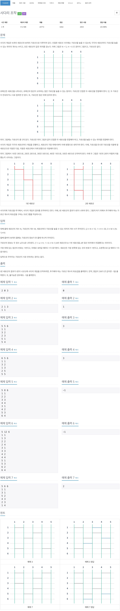
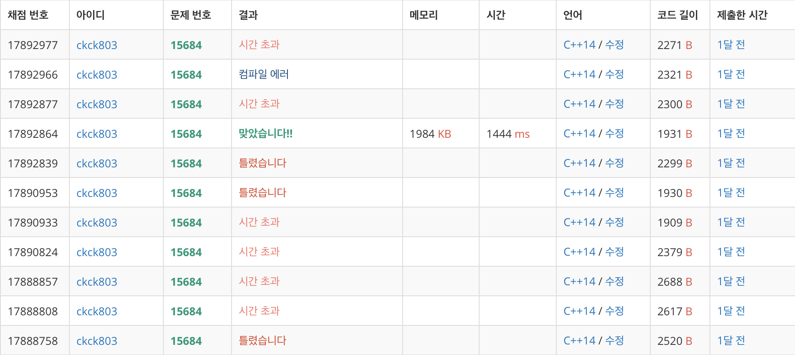

# 백준 15684 - 사다리 게임



## 채점 현황


## 전체 소스 코드
```cpp
#include <bits/stdc++.h>
using namespace std;

int N, M, H;
int Map[33][11];
int min_value = INT_MAX;

bool isAllI() {
    for (int i = 1; i <= N; i++) {
        int cnt_node = i;

        for (int j = 1; j <= H; j++) {
            if (cnt_node <= N && Map[j][cnt_node] == 1)
                cnt_node = cnt_node + 1;
            else if (cnt_node - 1 >= 1 && Map[j][cnt_node - 1] == 1)
                cnt_node = cnt_node - 1;
        }

        if (cnt_node != i) {
            return false;
        }
    }
    return true;
}

void dfs(int height, int num) {
    if (num > 3) {
        return;
    }

    if (isAllI()) {
        min_value = min(min_value, num);
        return;
    }

    for (int i = height; i <= H; i++) {
        for (int j = 1; j <= N; j++) {
            if (Map[i][j] == 0 && Map[i][j - 1] == 0 && Map[i][j + 1] == 0) {
                Map[i][j] = 1;
                dfs(i, num + 1);
                Map[i][j] = 0;
            }
        }
    }
}

int main(void) {
    cin.tie(0);
    cout.tie(0);
    ios_base::sync_with_stdio(false);
    cin >> N >> M >> H;

    for (int i = 0; i < M; i++) {
        int a, b;
        cin >> a >> b;
        Map[a][b] = 1;
    }

    dfs(1, 0);
    if (min_value == INT_MAX)
        cout << -1 << '\n';
    else
        cout << min_value << '\n';
    return 0;
}
```

## 파이썬 코드
```python
def isAllI():
    for i in range(1, N+1):
        cnt_node = i

        for j in range(1, H+1):
            if(ladder[j][cnt_node] == 1):
                cnt_node = cnt_node+1
            elif(ladder[j][cnt_node-1] == 1):
                cnt_node = cnt_node-1

        if(cnt_node != i):
            return False
    return True


def dfs(height, num):
    if(num > 3):
        return

    if(isAllI()):
        global min_value
        if(min_value > num):
            min_value = num
        return

    for i in range(height, H+1):
        for j in range(1, N+1):
            if(ladder[i][j] == 0 and ladder[i][j-1] == 0 and ladder[i][j+1] == 0):
                ladder[i][j] = 1
                dfs(i, num+1)
                ladder[i][j] = 0


N, M, H = map(int, input().split())

ladder = [[0] * (N+5) for _ in range(H+5)]
check = [[0] * (N+5) for _ in range(H+5)]

min_value = 987654321


for i in range(M):
    a, b = map(int, input().split())
    ladder[a][b] = 1

dfs(1, 0)

if(min_value == 987654321):
    print(-1)
else:
    print(min_value)
```