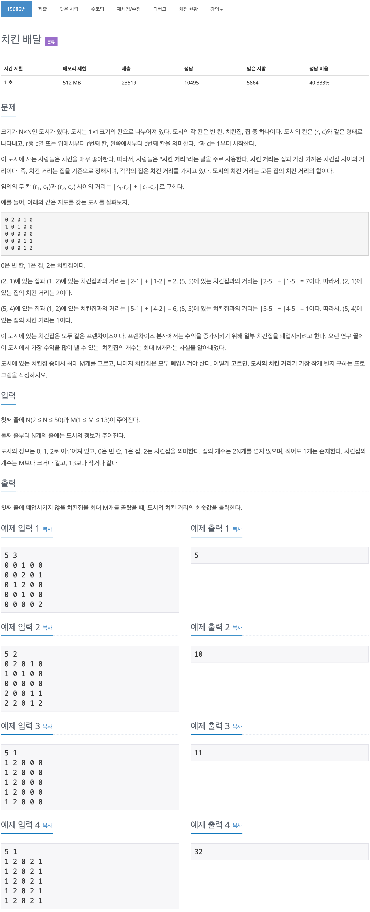

# 백준 15686 - 치킨 배달



## 전체 소스 코드
```cpp
#include <iostream>
#include <vector>
using namespace std;

int N, M;
int map[55][55];
int dx[4] = {1, -1, 0, 0};
int dy[4] = {0, 0, 1, -1};
vector<pair<int, int>> starts;
vector<pair<int, int>> goals;
bool check[3500];
int totalDist = 500000000;

int distance(pair<int, int> p1, pair<int, int> p2) {
    return abs(p1.first - p2.first) + abs(p1.second - p2.second);
}

void choiceGoal(int index, int n) {
    if (n == M) {
        vector<pair<int, int>> v;
        for (int i = 0; i < goals.size(); i++) {
            if (check[i] == true) {
                v.push_back(goals[i]);
                // cout << '(' << goals[i].first << ", " << goals[i].second << ')' << " ";
            }
        }
        // cout << endl;

        int dist = 0;
        for (int i = 0; i < starts.size(); i++) {
            int minDist = 500000000;

            for (int j = 0; j < v.size(); j++) {
                minDist = min(minDist, distance(starts[i], v[j]));
            }
            // cout << minDist << " ";
            dist += minDist;
        }
        // cout << endl;

        totalDist = min(totalDist, dist);
        return;
    }

    for (int i = index; i < goals.size(); i++) {
        check[i] = true;
        choiceGoal(i + 1, n + 1);
        check[i] = false;
    }
}

int main(void) {
    cin >> N >> M;

    for (int i = 0; i < N; i++) {
        for (int j = 0; j < N; j++) {
            cin >> map[i][j];

            if (map[i][j] == 1) {
                starts.push_back({i, j});
                map[i][j] = 0;
            }

            if (map[i][j] == 2) {
                goals.push_back({i, j});
                map[i][j] = 0;
            }
        }
    }

    choiceGoal(0, 0);

    cout << totalDist << '\n';
    return 0;
}
```