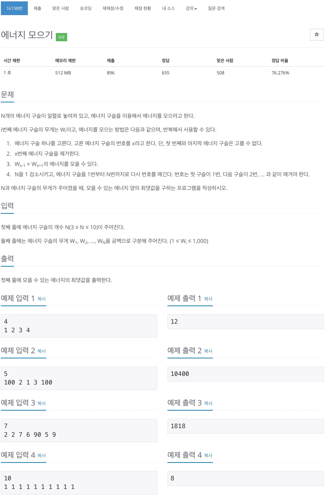

# 백준 16198 - 에너지 모으기



## 전체 소스 코드
```cpp
#include <iostream>
#include <vector>
using namespace std;

int n;
vector<int> v;
int maxValue = 0;

void returnArr(vector<int>& a, vector<int>& b) {
    a.clear();
    for (int i = 0; i < b.size(); i++) {
        a.push_back(b[i]);
    }
}

void chooseNum(int index, int total) {
    vector<int> arr;

    if (v.size() == 3) {
        total += v[0] * v[2];
        maxValue = max(maxValue, total);
        return;
    }

    for (int i = 0; i < v.size(); i++) {
        arr.push_back(v[i]);
    }

    int range = v.size() - 1;
    for (int i = 1; i < range; i++) {
        int multi = v[i - 1] * v[i + 1];
        v.erase(v.begin() + i);
        chooseNum(i + 1, total + multi);
        returnArr(v, arr);
    }
}

int main(void) {
    cin.tie(0);
    cout.tie(0);
    ios_base::sync_with_stdio(false);

    cin >> n;
    for (int i = 0; i < n; i++) {
        int temp;
        cin >> temp;
        v.push_back(temp);
    }

    chooseNum(1, 0);

    cout << maxValue << '\n';
    return 0;
}
```