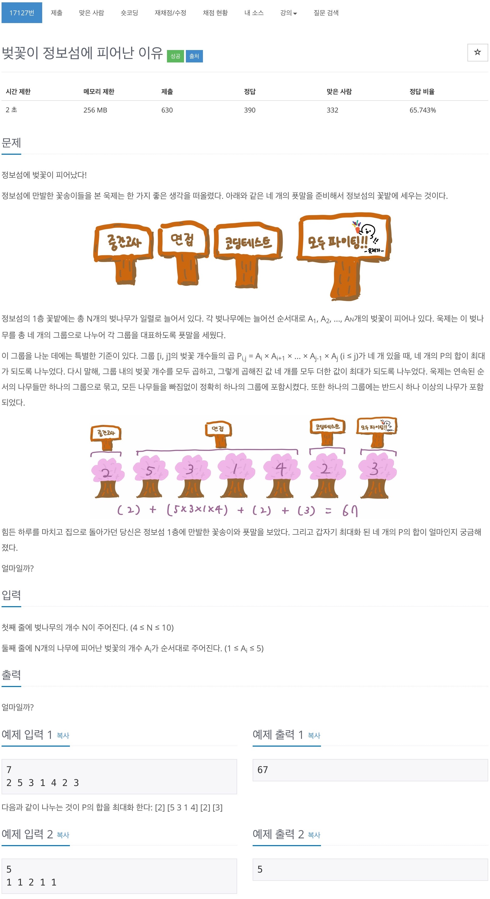

# 백준 17127 - 벚꽃이 정보섬에 피어난 이유



## 전체 소스 코드
```cpp
#include <bits/stdc++.h>
using namespace std;
int n;
int arr[10];
int maxValue = 0;

int main(void) {
    cin >> n;
    for (int i = 0; i < n; i++) {
        cin >> arr[i];
    }

    int num = n - 3;
    for (int i = 0; i < 4; i++) {
        int sum = 1;
        for (int j = i; j < i + num; j++) {
            sum *= arr[j];
        }
        for (int j = 0; j < i; j++) {
            sum += arr[j];
        }
        for (int j = i + n - 3; j < n; j++) {
            sum += arr[j];
        }

        maxValue = max(maxValue, sum);
    }

    cout << maxValue << '\n';
}
```