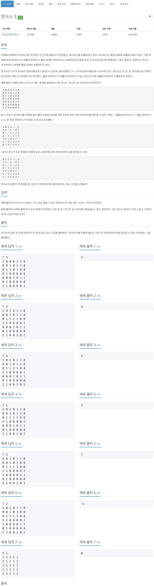
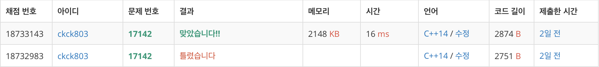

# 백준 17142 - 연구소 3



## 채점 현황



## 틀린이유

```cpp
while (!q.empty()) {
    int cntY = q.front().y;
    int cntX = q.front().x;
    int cntNum = q.front().num;
    q.pop();

    if (cnt < cntNum) {
        cnt = cntNum;
    }

    for (int i = 0; i < 4; i++) {
        int ny = cntY + dy[i];
        int nx = cntX + dx[i];

        if (0 <= ny && ny < lab_size && 0 <= nx && nx < lab_size) {
            if (check[ny][nx] == false && lab[ny][nx] == 0) {
                check[ny][nx] = true;
                q.push({ny, nx, cntNum + 1});
            }
        }
    }
}
```

비활성 바이러스에 대해 생각을 하지 않고 그냥 진행시켜서 틀리게 되었다.

## 문제 해설

연구소에 바이러스가 있는데 이 바이러스에는 상태값이 두개가 있다.

- 활성화 된 상태
- 비활성화 상태

1. 주어진 바이러스들 중에서 `M`개를 활성화 시켜야 하므로 조합을 이용해 **모든 경우의 수**를 구하면 된다.
2. 그 후 모든 경우의 수를 돌면서 `bfs`를 이용하여 연구소를 탐색한다. 탐색이 끝난 후 연구소에 바이러스가 다 퍼졌는지 확인한다.
   1. 다 퍼지지 못한 경우에는 그냥 반환한다.
   2. 만약 다 퍼졌을 경우 최솟값과 비교해 더 작은 값이면 최솟값을 갱신해주면 된다.

> 주의해야 할 점은 비활성화된 바이러스가 있는 곳도 일단은 바이러스가 있는 곳이라는 것을 염두해 두어야 한다. 이 문제에서는 비활성화된 바이러스의 상태를 어떻게 관리하느냐가 키 포인트이다.

## 시간 복잡도 계산
1. 바이러스를 선택할 수 있는 최대의 조합은 `10_C_5`이다.
2. `bfs`를 이용하여 연구소를 탐색하는 최대의 경우는 `50 x 50`이다.  

> 252 x 2500 = 630,000 즉, 최대 63만번의 연산을 하게 된다.

## M개의 바이러스를 선택하는 경우의 수 구하기

```cpp
void chooseVirus(int num, int index) {
    if (num == virus_num) {
        vector<int> v(virus_point.size());

        for (int i = 0; i < virus_point.size(); i++) {
            v[i] = virus[i];
        }
        arr_active_virus.push_back(v);
        return;
    }

    for (int i = index; i < virus_point.size(); i++) {
        virus[i] = 1;
        chooseVirus(num + 1, i + 1);
        virus[i] = 0;
    }
}
```

재귀를 이용하여 선택한 바이러스의 개수가 `M`개가 될 경우에 해당 배열을 저장해 준다. `arr_active_virus`에는 총 바이러스 중에서 `M`개의 바이러스를 뽑는 모든 경우의 수가 들어 있다.

## 연구소 탐색하기

### 경우의 수

```cpp
void bfs(int index) {
    queue<Point> q;
    memset(check, false, sizeof(check));
    vector<int> active_virus = arr_active_virus[index];

    for (int i = 0; i < active_virus.size(); i++) {
        if (active_virus[i] == 1) {
            q.push({virus_point[i].first, virus_point[i].second, 0});
            check[virus_point[i].first][virus_point[i].second] = true;
        }
    }
...
```

바이러스를 `M`개를 뽑을 수 있는 경우의 수 중 하나를 가져와 `queue`에 넣고 `bfs`를 시작한다.

```cpp
int cnt = 0;
while (!q.empty()) {
    int cntY = q.front().y;
    int cntX = q.front().x;
    int cntNum = q.front().num;
    q.pop();

    if (cnt < cntNum && lab[cntY][cntX] == 0) {
        cnt = cntNum;
    }

    for (int i = 0; i < 4; i++) {
        int ny = cntY + dy[i];
        int nx = cntX + dx[i];

        if (0 <= ny && ny < lab_size && 0 <= nx && nx < lab_size) {
            if (check[ny][nx] == false && lab[ny][nx] != 1) {
                check[ny][nx] = true;
                q.push({ny, nx, cntNum + 1});
            }
        }
    }
}
if (isAllVirus())
    minValue = min(minValue, cnt);
```

탐색을 하면서 벽`1`을 만나게 되는 경우를 제외하고는 모두 진행시킨다. 다만 경과 시간을 갱신할 때는 현재 위치가 비활성화된 바이러스일 때는 제외 하도록 한다. 왜냐하면 비활성화 바이러스칸에 접근하기 직전에 모든 연구소에 바이러스가 퍼지게 될 경우 **그 상태가 연구소에 모든 바이러스가 퍼진 상태**이기 때문이다.  
탐색을 마친 후 모든 연구소에 바이러스가 퍼졌는지 확인하고, 모두 퍼졌을 경우 값 갱신을 하게 된다.

## 연구소에 모든 바이러스가 퍼졌는지 확인하기

```cpp
bool isAllVirus() {
    for (int i = 0; i < lab_size; i++) {
        for (int j = 0; j < lab_size; j++) {
            if (lab[i][j] == 0 && check[i][j] == false) {
                return false;
            }
        }
    }

    return true;
}
```

## 전체 소스 코드

```cpp
#include <bits/stdc++.h>
using namespace std;

#define MAX 55
#define INF 987654321

int lab[MAX][MAX];
int copied_lab[MAX][MAX];
int lab_size;
int virus_num;
vector<pair<int, int>> virus_point;
vector<vector<int>> arr_active_virus;
bool check[MAX][MAX];
int virus[MAX];
int minValue = INF;
int dx[4] = {1, -1, 0, 0};
int dy[4] = {0, 0, 1, -1};

struct Point {
    int y;
    int x;
    int num;
};

bool isAllVirus() {
    for (int i = 0; i < lab_size; i++) {
        for (int j = 0; j < lab_size; j++) {
            if (lab[i][j] == 0 && check[i][j] == false) {
                return false;
            }
        }
    }

    return true;
}

void chooseVirus(int num, int index) {
    if (num == virus_num) {
        vector<int> v(virus_point.size());

        for (int i = 0; i < virus_point.size(); i++) {
            v[i] = virus[i];
        }
        arr_active_virus.push_back(v);
        return;
    }

    for (int i = index; i < virus_point.size(); i++) {
        virus[i] = 1;
        chooseVirus(num + 1, i + 1);
        virus[i] = 0;
    }
}

void bfs(int index) {
    queue<Point> q;
    memset(check, false, sizeof(check));
    vector<int> active_virus = arr_active_virus[index];

    for (int i = 0; i < active_virus.size(); i++) {
        if (active_virus[i] == 1) {
            q.push({virus_point[i].first, virus_point[i].second, 0});
            check[virus_point[i].first][virus_point[i].second] = true;
        }
    }

    int cnt = 0;
    while (!q.empty()) {
        int cntY = q.front().y;
        int cntX = q.front().x;
        int cntNum = q.front().num;
        q.pop();

        if (cnt < cntNum && lab[cntY][cntX] == 0) {
            cnt = cntNum;
        }

        for (int i = 0; i < 4; i++) {
            int ny = cntY + dy[i];
            int nx = cntX + dx[i];

            if (0 <= ny && ny < lab_size && 0 <= nx && nx < lab_size) {
                if (check[ny][nx] == false && lab[ny][nx] != 1) {
                    check[ny][nx] = true;
                    q.push({ny, nx, cntNum + 1});
                }
            }
        }
    }
    if (isAllVirus())
        minValue = min(minValue, cnt);
}

int main(void) {
    cin.tie(0);
    cout.tie(0);
    ios_base::sync_with_stdio(false);
    cin >> lab_size >> virus_num;

    for (int i = 0; i < lab_size; i++) {
        for (int j = 0; j < lab_size; j++) {
            cin >> lab[i][j];

            if (lab[i][j] == 2) {
                virus_point.push_back({i, j});
            }
        }
    }

    chooseVirus(0, 0);
    for (int i = 0; i < arr_active_virus.size(); i++) {
        bfs(i);
    }

    if (minValue == INF)
        cout << -1 << '\n';
    else
        cout << minValue << '\n';
    return 0;
}
```
