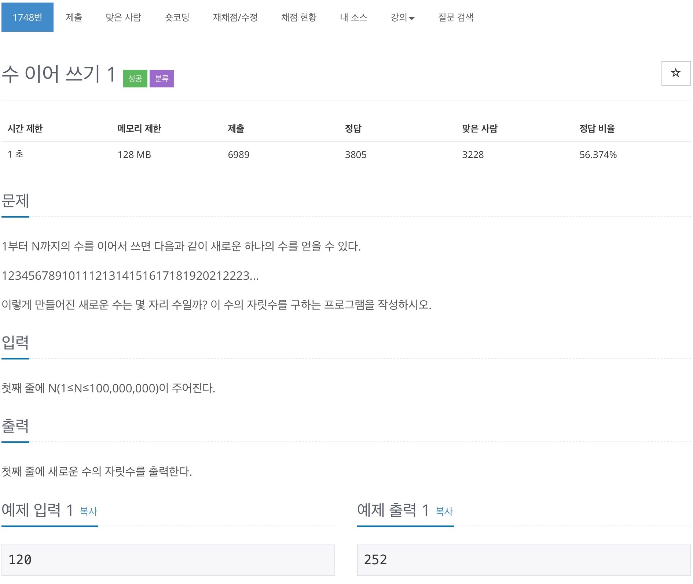

# 백준 1748 - 수 이어쓰기 1



## 전체 소스 코드
```cpp
#include <iostream>
using namespace std;

int n;
int total;

int main(void) {
    cin >> n;

    for (int i = 1; i <= n; i++) {
        int cntNum = i;
        int num = 0;

        while (cntNum) {
            cntNum /= 10;
            num++;
        }
        total += num;
    }

    cout << total << '\n';
    return 0;
}
```