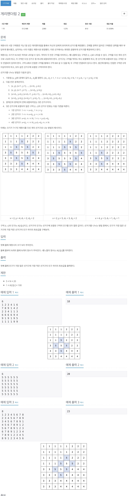

# 백준 17779 - 게리멘더링 2



## 체점 현황


## 문제 해설

`d1`, `d2`, `x`, `y`값들이 정해져 있지 않고 임의의 값들에 따라 지역구를 나눈 후 나누어진 지역구들의 가중치들을 합한 후 더한 값의 최대값과 최솟 값을 빼 주어야 한다. 전형적인 브루트포스 문제이다.

## 경계의 길이 구하기

```cpp
for (int d1 = 1; d1 < N; d1++) {
    for (int d2 = 1; d2 < N; d2++) {
        calPopulation(d1, d2);
    }
}
```

`d1`, `d2`는 크기 `N`이상을 절대 벗어날 수 없으므로 범위를 `N`까지를 잡은 상태에서 각각의 지역구에 해당하는 사람들을 확인하도록 한다.

## d1, d2의 변화에 따른 영역을 확인하기 위한 함수

```cpp
void calPopulation(int d1, int d2) {
    for (int y = 1; y < N; y++) {
        for (int x = 1; x < N; x++) {
            if (x < x + d1 + d2 && x + d1 + d2 <= N && 1 <= y - d1 && y - d1 < y && y < y + d2 && y + d2 <= N) {
                int MinValue = 987654321;
                int MaxValue = 0;

                // 색칠 초기화
                for (int i = 1; i <= N; i++) {
                    for (int j = 1; j <= N; j++) {
                        color[i][j] = 0;
                    }
                }

                // 5에 대한 색칠을 칠해준다.
                for (int i = 0; i <= d1; i++) {
                    for (int j = i; j <= d1; j++) {
                        color[y - i][x + j] = 5;
                    }
                }

                for (int i = 0; i <= d2; i++) {
                    for (int j = i; j <= d2; j++) {
                        color[y + i][x + j] = 5;
                    }
                }

                for (int i = 0; i < d2; i++) {
                    for (int j = i; j <= d2; j++) {
                        color[y - d1 + d2 - i][x + d1 + d2 - j] = 5;
                    }
                }

                for (int i = 0; i < d1; i++) {
                    for (int j = i; j <= d1; j++) {
                        color[y - d1 + d2 + i][x + d1 + d2 - j] = 5;
                    }
                }

                // 1에 대해 색칠해주기
                for (int i = 1; i < y; i++) {
                    for (int j = 1; j <= x + d1; j++) {
                        if (color[i][j] == 0) {
                            color[i][j] = 1;
                        }
                    }
                }

                // 2에 대해 색칠해주기
                for (int i = 1; i <= y - d1 + d2; i++) {
                    for (int j = x + d1 + 1; j <= N; j++) {
                        if (color[i][j] == 0) {
                            color[i][j] = 2;
                        }
                    }
                }

                // 3에 대해 색칠해주기
                for (int i = y; i <= N; i++) {
                    for (int j = 1; j < x + d2; j++) {
                        if (color[i][j] == 0) {
                            color[i][j] = 3;
                        }
                    }
                }

                // 4에 대해 색칠해주기
                for (int i = y - d1 + d2 + 1; i <= N; i++) {
                    for (int j = x + d2; j <= N; j++) {
                        if (color[i][j] == 0) {
                            color[i][j] = 4;
                        }
                    }
                }

                int area[6];
                for (int i = 1; i < 6; i++) {
                    area[i] = 0;
                }
                for (int i = 1; i <= N; i++) {
                    for (int j = 1; j <= N; j++) {
                        int cntColor = color[i][j];
                        area[cntColor] += map[i][j];
                    }
                }

                for (int i = 1; i < 6; i++) {
                    MinValue = min(MinValue, area[i]);
                    MaxValue = max(MaxValue, area[i]);
                }

                MinDist = min(MinDist, MaxValue - MinValue);
            }
        }
    }
}
```

여기서의 핵심은 `for`문을 이용하여 각각의 영역을 정확하게 탐색하게 하는 것이 중요한 것 같다. 각각 지역구에 해당하는 영역들을 색칠해 준 map에 적혀져 있는 가중치들을 색깔에 따라 계속 더해 간다. 그 후 최대값과 최솟값을 빼주면 원하는 답이 나온다.

## 다이아몬드 만들기

```cpp
// 5에 대한 색칠을 칠해준다.
for (int i = 0; i <= d1; i++) {
    for (int j = i; j <= d1; j++) {
        color[y - i][x + j] = 5;
    }
}

for (int i = 0; i <= d2; i++) {
    for (int j = i; j <= d2; j++) {
        color[y + i][x + j] = 5;
    }
}

for (int i = 0; i < d2; i++) {
    for (int j = i; j <= d2; j++) {
        color[y - d1 + d2 - i][x + d1 + d2 - j] = 5;
    }
}

for (int i = 0; i < d1; i++) {
    for (int j = i; j <= d1; j++) {
        color[y - d1 + d2 + i][x + d1 + d2 - j] = 5;
    }
}
```

영역 5 같은 경우에는 영역이 다이아몬드 형태로 나와있다.

## 전체 소스 코드

```cpp
/*
전형적인 브루트포스 문제
d1, d2, x, y를 주어진 조건에 맞게 계속 돌려준다.
주어진 조건을 통과하게 되면
5->1->2->3->4 순서대로 map을 색칠하는 작업에 들어가고
map을 색칠한 후에 같은 색에 속하는 area에 대해 값들을 다 더해준 후
큰 값과 작은 값을 빼서 가장 작은 차이와 계속 비교해 나가면서 값을 갱신해준다.

브루트포스를 돌리기 전에
밑에 있는 식에서 특정 조건때 해당되는 area가 만들어지는지
확인한 후 작업에 들어갔다.
*/

#include <iostream>
using namespace std;

int N;
int map[22][22];
int color[22][22];
int MinDist = 987654321;

void calPopulation(int d1, int d2) {
    for (int y = 1; y < N; y++) {
        for (int x = 1; x < N; x++) {
            if (x < x + d1 + d2 && x + d1 + d2 <= N && 1 <= y - d1 && y - d1 < y && y < y + d2 && y + d2 <= N) {
                int MinValue = 987654321;
                int MaxValue = 0;

                // 색칠 초기화
                for (int i = 1; i <= N; i++) {
                    for (int j = 1; j <= N; j++) {
                        color[i][j] = 0;
                    }
                }

                // 5에 대한 색칠을 칠해준다.
                for (int i = 0; i <= d1; i++) {
                    for (int j = i; j <= d1; j++) {
                        color[y - i][x + j] = 5;
                    }
                }

                for (int i = 0; i <= d2; i++) {
                    for (int j = i; j <= d2; j++) {
                        color[y + i][x + j] = 5;
                    }
                }

                for (int i = 0; i < d2; i++) {
                    for (int j = i; j <= d2; j++) {
                        color[y - d1 + d2 - i][x + d1 + d2 - j] = 5;
                    }
                }

                for (int i = 0; i < d1; i++) {
                    for (int j = i; j <= d1; j++) {
                        color[y - d1 + d2 + i][x + d1 + d2 - j] = 5;
                    }
                }

                // 1에 대해 색칠해주기
                for (int i = 1; i < y; i++) {
                    for (int j = 1; j <= x + d1; j++) {
                        if (color[i][j] == 0) {
                            color[i][j] = 1;
                        }
                    }
                }

                // 2에 대해 색칠해주기
                for (int i = 1; i <= y - d1 + d2; i++) {
                    for (int j = x + d1 + 1; j <= N; j++) {
                        if (color[i][j] == 0) {
                            color[i][j] = 2;
                        }
                    }
                }

                // 3에 대해 색칠해주기
                for (int i = y; i <= N; i++) {
                    for (int j = 1; j < x + d2; j++) {
                        if (color[i][j] == 0) {
                            color[i][j] = 3;
                        }
                    }
                }

                // 4에 대해 색칠해주기
                for (int i = y - d1 + d2 + 1; i <= N; i++) {
                    for (int j = x + d2; j <= N; j++) {
                        if (color[i][j] == 0) {
                            color[i][j] = 4;
                        }
                    }
                }

                int area[6];
                for (int i = 1; i < 6; i++) {
                    area[i] = 0;
                }
                for (int i = 1; i <= N; i++) {
                    for (int j = 1; j <= N; j++) {
                        int cntColor = color[i][j];
                        area[cntColor] += map[i][j];
                    }
                }

                for (int i = 1; i < 6; i++) {
                    MinValue = min(MinValue, area[i]);
                    MaxValue = max(MaxValue, area[i]);
                }

                MinDist = min(MinDist, MaxValue - MinValue);
            }
        }
    }
}

int main(void) {
    cin >> N;

    for (int i = 1; i <= N; i++) {
        for (int j = 1; j <= N; j++) {
            cin >> map[i][j];
        }
    }

    for (int d1 = 1; d1 < N; d1++) {
        for (int d2 = 1; d2 < N; d2++) {
            calPopulation(d1, d2);
        }
    }

    cout << MinDist << "\n";
    return 0;
}
```
