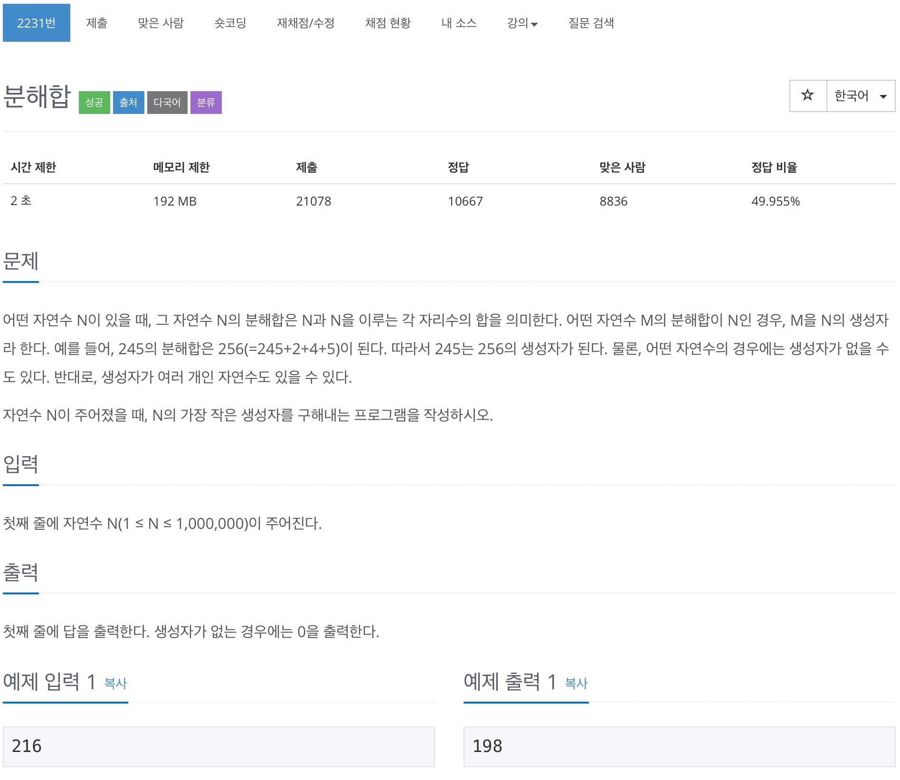

# 백준 2231 - 분해합

[2231 - 분해합](https://www.acmicpc.net/problem/2231)



## 전체 소스 코드
```cpp
#include <iostream>
using namespace std;

int n;
int min_value;

int main(void) {
    scanf("%d", &n);

    int i = 0;
    while (i <= n) {
        int sum = i;
        int temp = i;
        while (temp > 0) {
            int cnt_value = temp % 10;
            sum += cnt_value;
            temp /= 10;
        }
        if (sum == n) {
            min_value = i;
            break;
        }

        i++;
    }
    if (i == 216)
        printf(0);
    else {
        printf("%d\n", min_value);
    }

    return 0;
}
```
