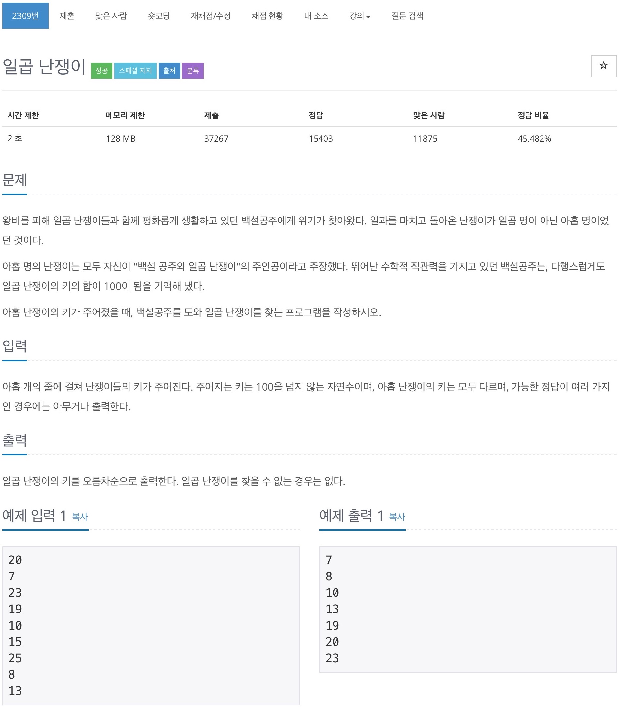

# 백준 2309 - 일곱 난쟁이



## 전체 소스 코드
```cpp
#include <algorithm>
#include <iostream>
#include <vector>
using namespace std;

int arr[9];
bool check[9];
bool isSuccess = false;

void choice(int start, int num, int sum) {
    if (num == 7 && sum == 100 && isSuccess == false) {
        isSuccess = true;
        vector<int> v;
        for (int i = 0; i < 9; i++) {
            if (check[i] == true) {
                v.push_back(arr[i]);
            }
        }

        for (int i = 0; i < 7; i++) {
            sort(v.begin(), v.end());
            cout << v[i] << '\n';
        }
        return;
    }

    for (int i = start; i < 9; i++) {
        check[i] = true;
        choice(i + 1, num + 1, sum + arr[i]);
        check[i] = false;
    }
}

int main(void) {
    for (int i = 0; i < 9; i++) {
        cin >> arr[i];
    }

    choice(0, 0, 0);

    return 0;
}
```