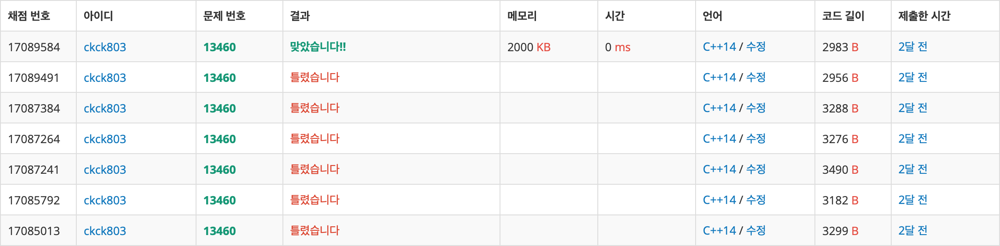

# 브루트 포스

| 문제              | 이름                        | 링크                                  | 정리여부 | 비고                      |
| ----------------- | :-------------------------- | ------------------------------------- | :------: | ------------------------- |
| [1051](1051/)     | 숫자 직사각형               | https://www.acmicpc.net/problem/1051  |          |                           |
| [1065](1065/)     | 한수                        | https://www.acmicpc.net/problem/1065  |          |                           |
| [1182](1182/)     | 부분수열의 합               | https://www.acmicpc.net/problem/1182  |          |                           |
| [1436](1436/)     | 영화감독 슘                 | https://www.acmicpc.net/problem/1436  |          |                           |
| [1748](1748/)     | 수 이어쓰기1                | https://www.acmicpc.net/problem/1748  |          |                           |
| [2231](<(2231/)>) | 분해 합                     | https://www.acmicpc.net/problem/2231  |          |                           |
| [2309](2309/)     | 일곱 난쟁이                 | https://www.acmicpc.net/problem/2309  |          |                           |
| [2798](2798/)     | 블랙잭                      | https://www.acmicpc.net/problem/2798  |          |                           |
| [3085](3085/)     | 사탕 게임                   | https://www.acmicpc.net/problem/3085  |          |                           |
| [7568](7568/)     | 덩치                        | https://www.acmicpc.net/problem/7568  |          |                           |
| [10448](10448/)   | 유레카 이론                 | https://www.acmicpc.net/problem/10448 |          |                           |
| [12100](12100/)   | 2048(Easy)                  | https://www.acmicpc.net/problem/12100 |          |                           |
| [12738](12738/)   | 가장 긴 증가하는 부분 수열3 | https://www.acmicpc.net/problem/12738 |          |                           |
| [13460](13460/)   | 구슬 탈출2                  | https://www.acmicpc.net/problem/13460 |    O     | while문을 이용한 `bfs`    |
| [14502](14502/)   | 연구소                      | https://www.acmicpc.net/problem/14502 |          |                           |
| [14888](14888/)   | 연산자 끼워넣기             | https://www.acmicpc.net/problem/14888 |          |                           |
| [14889](14889/)   | 스타크와 링크               | https://www.acmicpc.net/problem/14889 |          |                           |
| [15653](15653/)   | 구슬 탈출4                  | https://www.acmicpc.net/problem/15653 |    O     | while문을 이용한 `bfs`    |
| [15683](15683/)   | 감시                        | https://www.acmicpc.net/problem/15683 |          |                           |
| [15684](15684/)   | 사다리 조작                 | https://www.acmicpc.net/problem/15684 |          |                           |
| [15686](15686/)   | 치킨 배달                   | https://www.acmicpc.net/problem/14686 |          |                           |
| [16198](16198/)   | 에너지 모으기               | https://www.acmicpc.net/problem/16198 |          |                           |
| [17127](17127/)   | 벚꽃이 정보섬에 피어난 이유 | https://www.acmicpc.net/problem/17127 |          |                           |
| [17142](17142/)   | 연구소 3                    | https://www.acmicpc.net/problem/17142 |          | 조합, 경우의 수 탐색`bfs` |
| [17779](17779/)   | 게리멘더링2                 | https://www.acmicpc.net/problem/17779 |    O     | 영역 나누어 탐색하기      |

## 체점 현황

### [13460](13460/) - 구슬 탈출2

### [15653](15653/) - 구슬 탈출4

### [17142](17142/) - 연구소 3

### [17779](17779/) - 게리멘더링2

