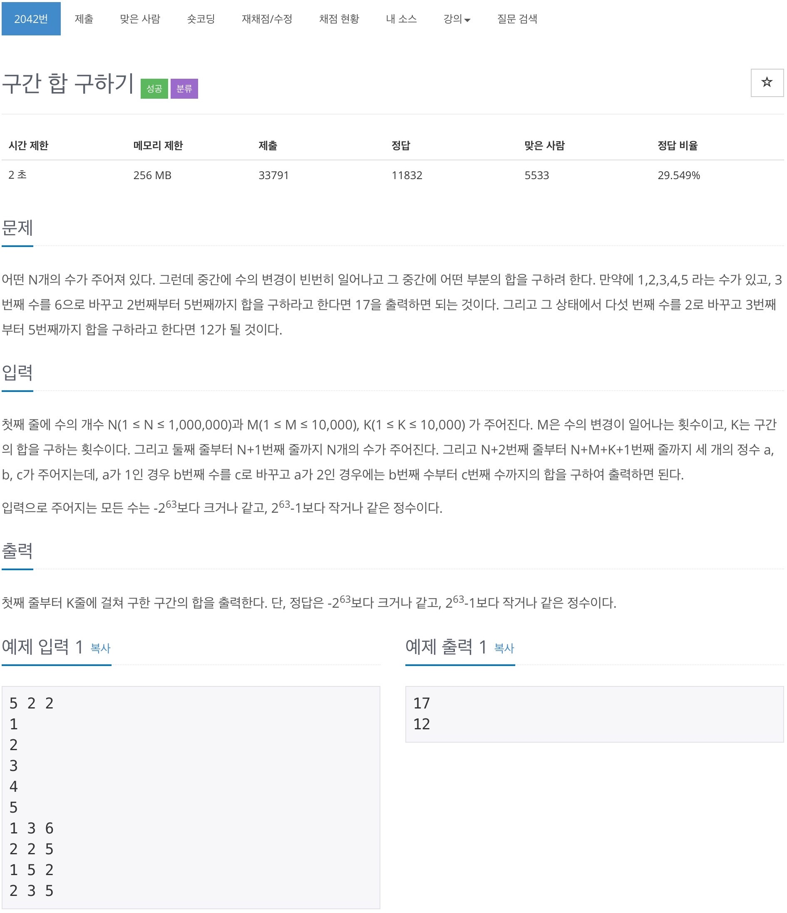

# 백준 2042 - 구간 합 구하기



## 전체 소스 코드
```python
#include <bits/stdc++.h>
using namespace std;

int N, M, K;
long long arr[1000001];
long long tree[3000001];

long long init(int node, int start, int finish) {
    if (start == finish) {
        return tree[node] = arr[start];
    }

    int mid = (start + finish) / 2;
    tree[node] = init(node * 2, start, mid) + init(node * 2 + 1, mid + 1, finish);
    return tree[node];
}

long long sum(int left, int right, int node, int start, int finish) {
    if (left <= start && finish <= right) {
        return tree[node];
    }

    if (right < start || left > finish) {
        return 0;
    }

    int mid = (start + finish) / 2;
    return sum(left, right, node * 2, start, mid) + sum(left, right, node * 2 + 1, mid + 1, finish);
}

void update(int node, int start, int finish, int value, int diff) {
    if (start <= value && value <= finish) {
        tree[node] += diff;
    } else {
        return;
    }

    if (start == finish) {
        return;
    }

    int mid = (start + finish) / 2;
    update(node * 2, start, mid, value, diff);
    update(node * 2 + 1, mid + 1, finish, value, diff);
}

int main(void) {
    cin.tie(0);
    cout.tie(0);
    ios_base::sync_with_stdio(false);
    cin >> N >> M >> K;
    for (int i = 1; i <= N; i++) {
        cin >> arr[i];
    }
    init(1, 1, N);

    for (int i = 0; i < M + K; i++) {
        long long a, b, c;
        cin >> a >> b >> c;

        if (a == 1) {
            long long diff = c - arr[b];
            arr[b] = c;
            update(1, 1, N, b, diff);
        } else {
            long long value = sum(b, c, 1, 1, N);
            cout << value << '\n';
        }
    }
    return 0;
}
```