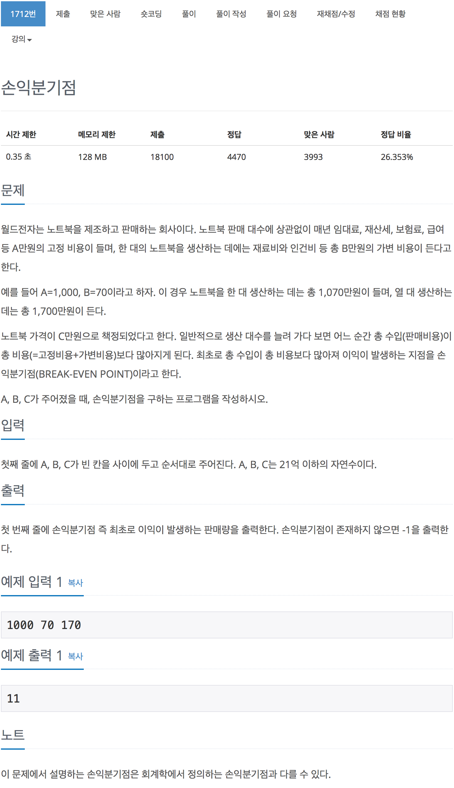

# 백준 1712 - 손익분기점

[1712 - 손익분기점](https://www.acmicpc.net/problem/1712)


```cpp
#include <iostream>
using namespace std;

int MAX_VALUE = 2100000000;
long long a, b, c;

int main(void)
{
    cin >> a >> b >> c;
    long long sell = c;
    long long cost = b;

    if (b >= c)
    {
        cout << -1 << endl;
        return 0;
    }

    int i = a / (c - b) + 1;

    cout << i << endl;

    return 0;
}
```
