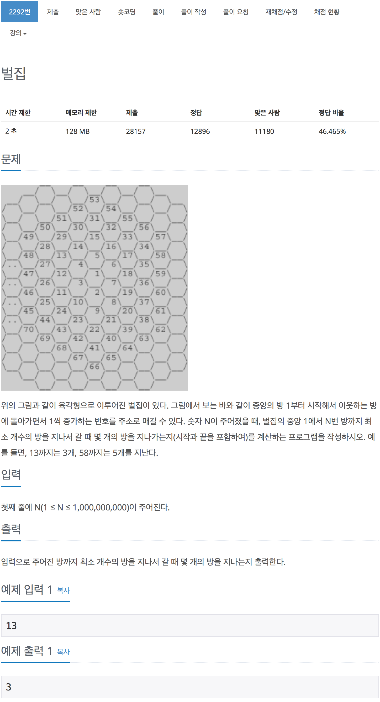

# 백준 2292 - 벌집

[2292 - 벌집](https://www.acmicpc.net/problem/2292)


```cpp
#include <iostream>
using namespace std;

int a = 1, b;
long long n;

int main(void)
{
    long long c = 0;
    cin >> n;

    int i = 1;
    while (a < n)
    {
        i++;
        b += 6;
        a += b;
        // cout << a << endl;
    }
    cout << i << endl;

    return 0;
}
```
