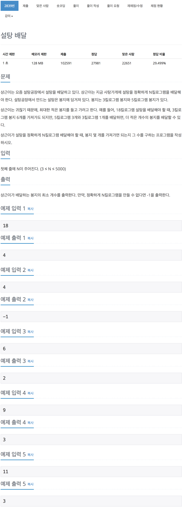

# 백준 2839 - 설탕 배달

[2839 - 설탕 배달](https://www.acmicpc.net/problem/2839)



```cpp
#include <iostream>
using namespace std;

int a = 3, b = 5;
int n;

int main(void)
{
    cin >> n;
    int a_max = n / a + 1;
    int b_max = n / b;

    for (int i = b_max; i >= 0; i--)
    {
        for (int j = 0; j < a_max; j++)
        {
            if (a * j + b * i > n)
                continue;
            else if (a * j + b * i == n)
            {
                cout << i + j << endl;
                return 0;
            }
        }
    }

    cout << -1 << endl;
    return 0;
}
```
