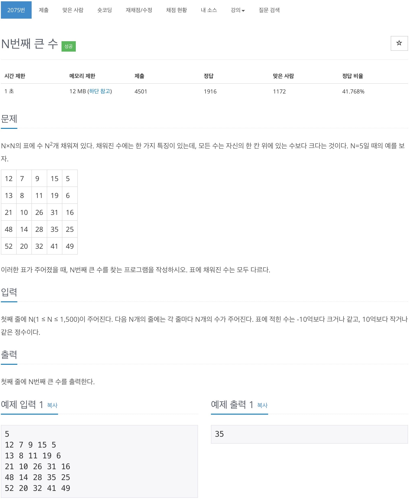

# 백준 2075 - 슬라이딩 윈도우



## 전체 소스 코드
```cpp
#include <bits/stdc++.h>
using namespace std;

int main(void) {
    cin.tie(0);
    cout.tie(0);
    ios_base::sync_with_stdio(false);

    int n;
    priority_queue<int, vector<int>, greater<int>> pq;

    cin >> n;
    int value;
    for (int i = 0; i < n * n; i++) {
        cin >> value;

        if (pq.size() < n) {
            pq.push(value);
        } else {
            if (pq.top() < value) {
                pq.pop();
                pq.push(value);
            }
        }
    }
    cout << pq.top() << '\n';
    return 0;
}
```