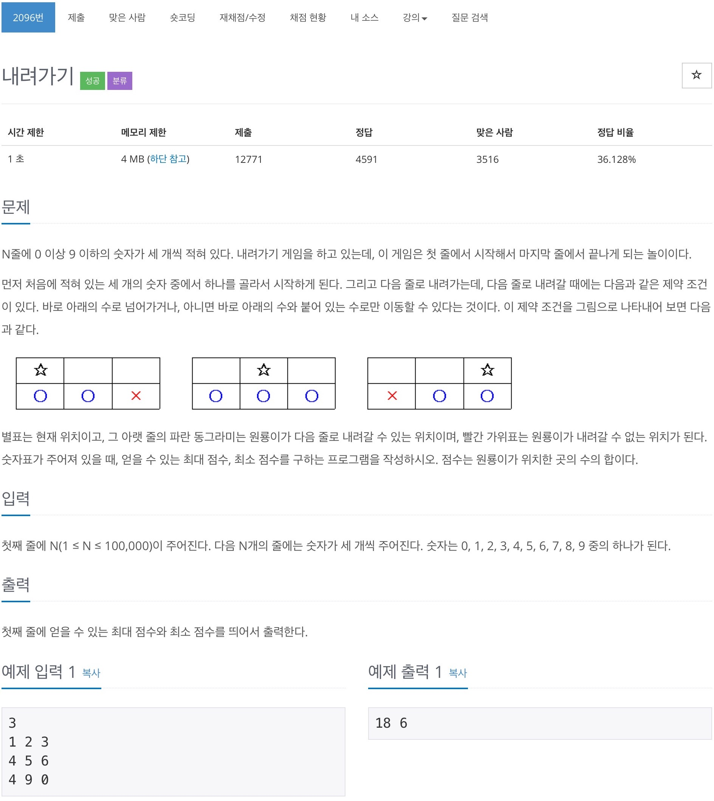

# 백준 2096 - 내려가기



## 전체 소스 코드
```cpp
#include <bits/stdc++.h>
using namespace std;

int dp_max[3];
int dp_min[3];

int main(void) {
    cin.tie(0);
    cout.tie(0);
    ios_base::sync_with_stdio(false);
    int n;
    cin >> n;
    for (int i = 0; i < 3; i++) {
        cin >> dp_max[i];
        dp_min[i] = dp_max[i];
    }

    for (int i = 1; i < n; i++) {
        int arr[3];
        for (int j = 0; j < 3; j++) {
            cin >> arr[j];
        }

        int next_max_dp[3];
        for (int j = 0; j < 3; j++) {
            next_max_dp[j] = arr[j] + dp_max[j];
            if (j - 1 >= 0)
                next_max_dp[j] = max(next_max_dp[j], arr[j] + dp_max[j - 1]);
            if (j + 1 < 3)
                next_max_dp[j] = max(next_max_dp[j], arr[j] + dp_max[j + 1]);
        }

        int next_min_dp[3];
        for (int j = 0; j < 3; j++) {
            next_min_dp[j] = arr[j] + dp_min[j];
            if (j - 1 >= 0)
                next_min_dp[j] = min(next_min_dp[j], arr[j] + dp_min[j - 1]);
            if (j + 1 < 3)
                next_min_dp[j] = min(next_min_dp[j], arr[j] + dp_min[j + 1]);
        }

        for (int j = 0; j < 3; j++) {
            dp_max[j] = next_max_dp[j];
            dp_min[j] = next_min_dp[j];
        }
    }

    cout << *max_element(dp_max, dp_max + 3) << " " << *min_element(dp_min, dp_min + 3) << '\n';
    return 0;
}
```