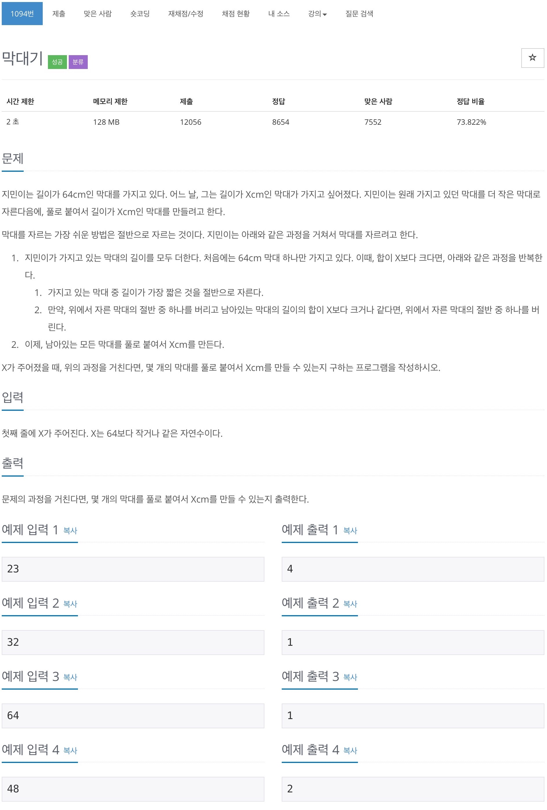
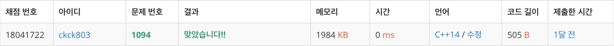

# 백준 1094 - 막대기



## 채점 현황


## 전체 소스 코드
```cpp
#include <iostream>
using namespace std;

int MinLength = 64;
int totalLength = 0;
int num = 0;
int X;

int main(void) {
    cin >> X;

    while (totalLength != X) {
        if (MinLength + totalLength == X) {
            totalLength += MinLength;
            num++;
        } else if (MinLength + totalLength > X) {
            MinLength /= 2;
        } else {
            totalLength += MinLength;
            MinLength /= 2;
            num++;
        }
    }

    cout << num << '\n';
    return 0;
}
```