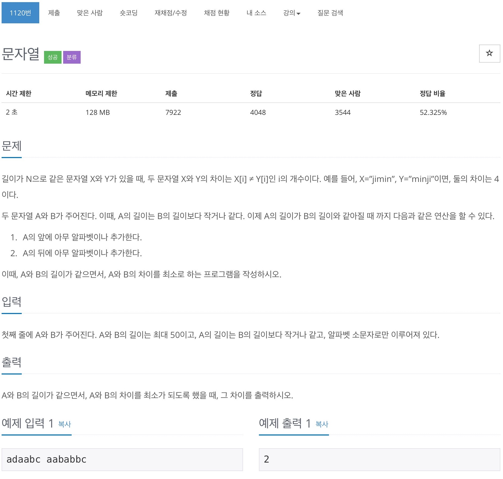
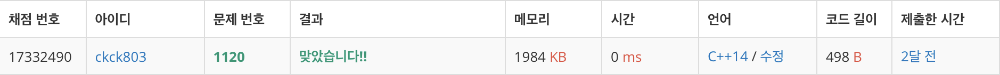

# 백준 1120 - 문자열



## 채점 현황


## 전체 소스 코드
```cpp
#include <iostream>
#include <string>
using namespace std;

string A, B;
int minDiff = 51;

int main(void) {
    cin >> A >> B;

    int ASize = A.size();
    int BSize = B.size();

    for (int i = 0; i <= BSize - ASize; i++) {
        int diff = 0;
        for (int j = 0; j < ASize; j++) {
            if (A[j] != B[i + j]) {
                diff++;
            }
        }

        if (minDiff > diff) {
            minDiff = diff;
        }
    }

    cout << minDiff << '\n';

    return 0;
}
```