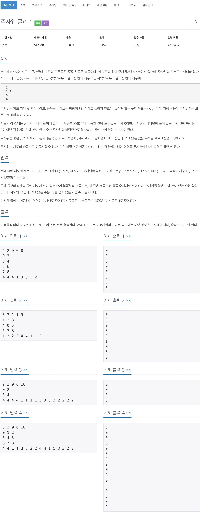
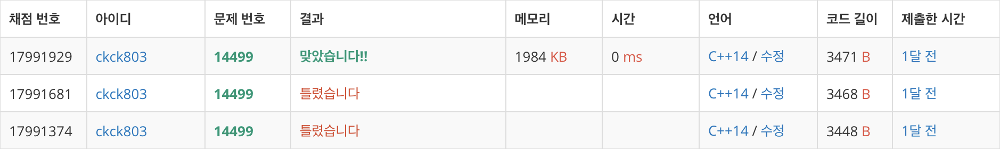

# 백준 14499 - 주사위 굴리기



## 채점 현황



## 전체 소스 코드
```cpp
#include <algorithm>
#include <iostream>
#include <queue>
using namespace std;

char map[12][6];
int num;
int dx[4] = {1, -1, 0, 0};
int dy[4] = {0, 0, 1, -1};
bool isDeleted;

void downPuyo() {
    for (int j = 0; j < 6; j++) {
        for (int i = 10; i >= 0; i--) {
            if (map[i + 1][j] == '.' && map[i][j] != '.') {
                while (map[i + 1][j] == '.' && i <= 10) {
                    swap(map[i + 1][j], map[i][j]);
                    i++;
                }
            }
        }
    }
}

void deletePuyo(int y, int x, char color) {
    queue<pair<int, int>> q;
    q.push({y, x});
    map[y][x] = '.';

    while (!q.empty()) {
        int cntY = q.front().first;
        int cntX = q.front().second;
        q.pop();

        for (int i = 0; i < 4; i++) {
            int ny = cntY + dy[i];
            int nx = cntX + dx[i];

            if (0 <= ny && ny < 12 && 0 <= nx && nx < 6) {
                if (map[ny][nx] == color) {
                    q.push({ny, nx});
                    map[ny][nx] = '.';
                }
            }
        }
    }
    isDeleted = true;
}

bool findPuyo(int y, int x, char color) {
    int n = 1;
    queue<pair<int, int>> q;
    vector<vector<bool>> check(12, vector<bool>(6, false));

    q.push({y, x});
    check[y][x] = true;

    while (!q.empty()) {
        int cntY = q.front().first;
        int cntX = q.front().second;
        q.pop();

        if (n >= 4) {
            return true;
        }

        for (int i = 0; i < 4; i++) {
            int ny = cntY + dy[i];
            int nx = cntX + dx[i];

            if (0 <= ny && ny < 12 && 0 <= nx && nx < 6) {
                if (map[ny][nx] == color && check[ny][nx] == false) {
                    check[ny][nx] = true;
                    q.push({ny, nx});
                    n++;
                }
            }
        }
    }

    return false;
}

int main(void) {
    for (int i = 0; i < 12; i++) {
        for (int j = 0; j < 6; j++) {
            cin >> map[i][j];
        }
    }

    do {
        isDeleted = false;
        for (int i = 0; i < 12; i++) {
            for (int j = 0; j < 6; j++) {
                if (map[i][j] != '.') {
                    if (findPuyo(i, j, map[i][j])) {
                        deletePuyo(i, j, map[i][j]);
                    }
                }
            }
        }

        if (isDeleted == true) {
            downPuyo();
            num++;
        }
    } while (isDeleted);

    cout << num << '\n';
    return 0;
}
```