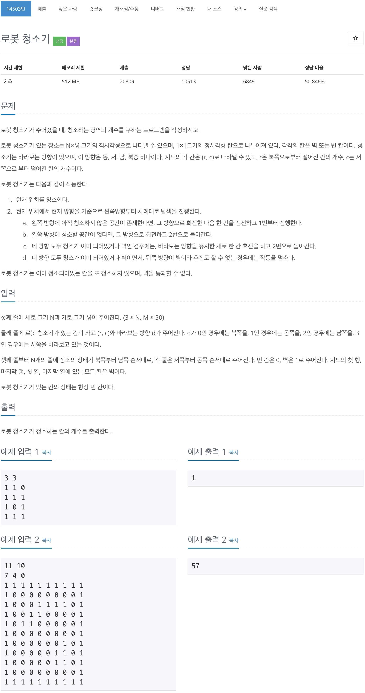
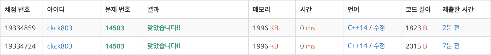

# 백준 14503 - 로봇 청소기



## 채점 현황



## 전체 소스 코드
```cpp
#include <bits/stdc++.h>
using namespace std;

int N, M;
int dir = 0;
int dy[4] = {-1, 0, 1, 0};
int dx[4] = {0, 1, 0, -1};
int Map[51][51];
bool isVisited[51][51];
int num;

void cleanRoom(int y, int x, int dir, int dir_num) {
    // 왼쪽 방향에 아직 청소하지 않은 공간이 존재한다면, 그 방향으로 회전한 다음 한 칸을 전진하고 1번부터 진행한다.
    // 왼쪽 방향에 청소할 공간이 없다면, 그 방향으로 회전하고 2번으로 돌아간다.
    // 네 방향 모두 청소가 이미 되어있거나 벽인 경우에는, 바라보는 방향을 유지한 채로 한 칸 후진을 하고 2번으로 돌아간다.
    // 네 방향 모두 청소가 이미 되어있거나 벽이면서, 뒤쪽 방향이 벽이라 후진도 할 수 없는 경우에는 작동을 멈춘다.

    int left = (dir + 3) % 4;
    int ny = y + dy[left];
    int nx = x + dx[left];

    int back = (dir + 2) % 4;
    int by = y + dy[back];
    int bx = x + dx[back];

    if (dir_num < 4) {
        if (0 <= ny && ny < N && 0 <= nx && nx < M && Map[ny][nx] == 0 && !isVisited[ny][nx]) {
            isVisited[ny][nx] = true;
            num++;
            cleanRoom(ny, nx, left, 0);
        } else {
            cleanRoom(y, x, left, dir_num + 1);
        }
    } else {
        if ((0 <= by && by < N && 0 <= bx && bx < M && Map[by][bx] == 0)) {
            cleanRoom(by, bx, dir, 0);
        } else {
            return;
        }
    }
}

int main(void) {
    cin >> N >> M;
    int startY, startX, startDir;
    cin >> startY >> startX >> startDir;

    for (int i = 0; i < N; i++) {
        for (int j = 0; j < M; j++) {
            cin >> Map[i][j];
        }
    }

    num++;
    isVisited[startY][startX] = true;
    cleanRoom(startY, startX, startDir, 0);

    cout << num << endl;
}
```