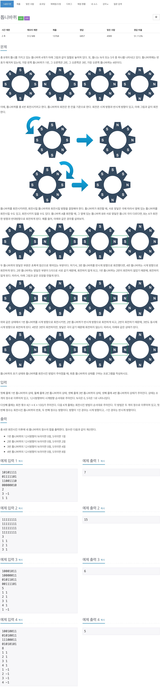

# 백준 15662 - 톱니바퀴



## 채점 현황


## 전체 소스 코드
```cpp
#include <bits/stdc++.h>
using namespace std;

int arr[5][8];

void turnGear(int index, int dir) {
    int temp[8];

    for (int i = 0; i < 8; i++) {
        temp[i] = arr[index][i];
    }

    for (int i = 0; i < 8; i++) {
        arr[index][(i + dir + 8) % 8] = temp[i];
    }
}

int main(void) {
    for (int i = 1; i <= 4; i++) {
        for (int j = 0; j < 8; j++) {
            scanf("%1d", &arr[i][j]);
        }
    }

    int k;
    cin >> k;
    while (k--) {
        int index, dir;
        cin >> index >> dir;

        int right = arr[index][2];
        int left = arr[index][6];

        turnGear(index, dir);

        int right_index = index + 1;
        int right_dir = dir * -1;
        while (right_index <= 4 && right != arr[right_index][6]) {
            right = arr[right_index][2];

            turnGear(right_index, right_dir);
            right_index++;
            right_dir *= -1;
        }

        int left_index = index - 1;
        int left_dir = dir * -1;
        while (left_index > 0 && left != arr[left_index][2]) {
            left = arr[left_index][6];

            turnGear(left_index, left_dir);
            left_index--;
            left_dir *= -1;
        }
    }

    int score = 0;
    int accumulate = 1;
    for (int i = 1; i <= 4; i++) {
        if (arr[i][0] == 0) {
            score += 0;
        } else {
            score += accumulate;
        }
        accumulate *= 2;
    }

    cout << score << '\n';
    return 0;
}
```